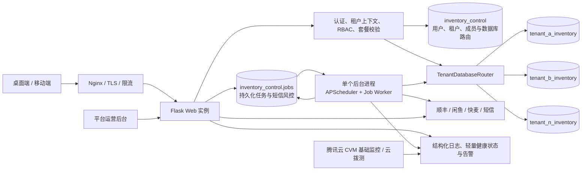

# SaaS 转型设计：基础与数据模型

> 返回：[总体设计索引](../design.md)

## 1. Context

### 1.1 当前状态

现有 `InventoryManager` 是 Flask + SQLAlchemy + MySQL 的模块化单体，包含 Vue 3 桌面端和独立 Vue 3 移动端。Docker Compose 虽定义了 Redis，但当前核心业务并不依赖它；D08 已决定 SaaS Core 不引入 Redis 运行依赖。

基于当前代码盘点，SaaS 化存在以下结构性缺口：

- `app/__init__.py` 对内部蓝图统一开放，前端路由无登录守卫；除 `/external-api` 的单个全局 API key 外没有身份认证。D55 已确认该遗留路由和 key 不迁移为租户能力，Core 必须移除或保持其不可达。
- 应用只配置一个固定业务数据库连接，没有控制库、租户数据库注册表、可信路由或租户库身份校验。
- 设备、型号、租赁、统计、验货、接力、审计和闲鱼告警等业务数据全部位于当前单一业务数据库；新租户无法获得独立数据库。
- 业务代码大量使用 Flask-SQLAlchemy 的全局 `db.session`。必须保证该 session 在每次请求/任务中绑定到正确租户数据库，且不能通过客户端参数选择任意数据库。
- 顺丰、闲鱼、快麦、OCR 的凭证和发件信息来自全局环境变量，无法支持每个租户使用独立账号。顺丰下单服务还是进程级 singleton，partner/checkword/月结号/sender 对所有订单全局共享；月结号缺失时当前代码可能把字符串 `"None"` 发给 provider。
- 当前批量顺丰下单逐笔产生外部副作用，最后才统一 `db.session.commit()`，且没有持久 execution/waybill ledger；进程在第三方成功与本地提交之间中断时可能重复下单或丢失运单映射。追踪任务也使用全局 credential 和全局查询手机号后四位，无法按历史运单账号正确分组恢复。
- APScheduler 在 Web 应用初始化时启动，并通过本机文件锁避免重复；该方式不适用于多实例、容器滚动升级和租户级重试。
- 当前 `requirements.txt` 只声明了另一个 `schedule` 包而没有声明代码实际 import 的 `apscheduler`；干净镜像可能在初始化时抛出 `ModuleNotFoundError`，而应用工厂会捕获异常后继续启动 Web，造成所有现有 APScheduler 任务静默未运行。Phase 0 必须以生产镜像 import smoke test、启动日志和 job inventory 验证实际状态，不能把旧文档中的“每小时任务”视为已生效。
- 仓库根目录已有 `simple_backup.sh`，目标路径 `/volume3/backup/db` 表明它应由 NAS 本机任务计划器调用；脚本执行 `mysqldump --all-databases` 后 gzip，但代码库没有 crontab/systemd/Compose 或 APScheduler 的小时级注册，因此无法从仓库证明生产环境确实每小时执行。应用中名为 `run_hourly_task` 的函数实际更新顺丰轨迹，且当前 scheduler 也未注册它，不是数据库备份。
- `env.production` 虽声明 `BACKUP_ENABLED=true`、保留 30 天和每天 02:00 的 `BACKUP_SCHEDULE`，但应用配置、Compose 和调度代码均未读取这些变量；它们目前只是未接线模板，而且也不是小时级设置。若生产 NAS 当前每小时备份，其实际 schedule 只存在于 NAS Task Scheduler/crontab 等仓库外配置，迁移前必须导出并纳入受控部署清单。
- 现有备份脚本把 root 密码硬编码在已跟踪文件中，未指定远端 host、未启用一致性参数、未检查 pipeline/文件有效性却无条件记录成功，也没有 checksum、保留清理、manifest、失败告警或恢复验证。SaaS 改造不能原样沿用；该密码按已泄露处理并轮换，D23 只复用“NAS 外部调度、主动拉取”的思路，备份不做静态加密则按 D24 执行。
- 配置中仍保留本地 `UPLOAD_FOLDER`，但代码盘点未发现 Core 需要长期保存的通用业务上传；OCR 图片只在内存中处理且该功能将删除。面单/PDF 等临时结果仍需补齐租户鉴权和清理约束。
- 审计日志没有 `user_id`、请求 ID和 actor 类型，也不能区分用户、遗留外部调用、任务和平台管理员；租户身份也尚未进入结构化日志上下文。D55 移除遗留外部认证路径后，Core 无需新增 API-key actor 类型。

### 1.2 Design assumptions

- 第一阶段继续使用 Flask、SQLAlchemy、MySQL 和 Vue，不为 SaaS 化本身重写技术栈，也不引入 Redis。
- D01 已确认：所有租户拥有独立业务数据库；首期这些数据库共享同一个 MySQL 实例。
- 控制面路由同时保存 `database_instance_key` 与 `database_name`，未来可把单个租户迁往其他 MySQL 实例，不改变业务 API。
- 一个手机号用户只能拥有一个有效 tenant membership；登录后服务端直接解析唯一租户，不提供租户切换。
- SaaS Core 采用兑换码注册/续期和平台受审计的服务期调整，不依赖支付渠道即可上线试点；成员邀请只用于已有租户增加成员，不能创建新租户。
- 默认部署为同域 Web 应用，使用安全 Cookie 会话；不把长期 JWT 放入浏览器 localStorage。

## 2. Goals / Non-Goals

### Goals

- 在不重写现有核心业务的前提下建立可验证的强租户隔离。
- 提供用户身份、成员邀请、固定角色 RBAC 和平台运维身份；一个用户只归属一个租户。
- 使每个租户拥有独立的第三方账号、业务设置、文件命名空间、任务和套餐额度。
- 以 expand/backfill/enforce/contract 方式迁移现有生产数据，并保持可回滚。
- 支持 Web 与 worker 水平扩容、幂等任务、集中审计、备份恢复和可观测性。
- 为商业化预留套餐、订阅、账单 provider 和用量计量模型。

### Non-Goals for SaaS Core

- 不拆分设备、租赁、发货等微服务。
- 不首发自定义角色编辑器，先使用固定角色映射；数据库结构保留扩展点。
- 不首发企业 SSO/SAML、SCIM、多区域 active-active 或租户自定义域名。
- 不承诺首发自动扣款；支付渠道由 Commercial SaaS 阶段实现。
- D55 已确认 Core 不提供 tenant API key、机器身份或外部租户业务 API；未来如需开放，必须在 Core 之后另立产品与安全决策，而不是预留可启用的运行路径。
- 除多仓库和逻辑附件单元自动分配所必需的结构外，不在本变更中重构其他租赁领域语义或一次性改造全部历史业务 API。

## 3. Target Architecture



D01 已确定数据库边界；D09 已确定使用“模块化单体 + 单个独立后台进程 + MySQL 持久任务表”。D22 进一步确认 Core 暂时把应用、worker 与该共享 MySQL 实例部署在同一台云主机的 Docker Compose 中；图中的 control plane 与 tenant database 节点是同一 MySQL 实例内的逻辑 schema，不代表独立主机。未来负载增长时可在不改变 job contract 的前提下扩为多个 worker、替换专用队列或按 `database_instance_key` 迁出数据库。

### 3.1 Core single-host Docker deployment (D22 confirmed)

- Nginx、Flask Web、单个 worker 和 MySQL 运行在同一台云主机的 Compose 项目中；这是阶段性部署边界，不等于把各租户重新合并进同一张业务表。
- MySQL 数据必须写入容器 writable layer 之外的明确持久卷；删除/recreate MySQL 容器不得删除数据卷。是否使用单独挂载的云硬盘及其快照策略由 D10 与实际云厂商能力确认，但 Docker volume、同机目录、副本容器和同机快照都不能被视为唯一备份。
- MySQL 不映射公网 `3306`，应用通过内部 Compose network 连接；人工维护从受控账号经 SSH 隧道或在主机内使用受限 MySQL 客户端。生产 Compose 不硬编码密码、完整 DSN 或根密钥。
- 给 MySQL 与 app/worker 设置独立资源预算和健康检查；不得让批量导出、PDF、日志或临时文件填满数据库数据盘。具体 CPU、内存、磁盘水位和连接池阈值在 Phase 0 按真实负载确认。
- 同机部署意味着云主机、系统盘、Docker daemon 或宿主机误操作可同时中断 Web、worker 与数据库，Core 不具备数据库 HA。上线前必须按 D23 每小时把一致性备份传到家庭 NAS，并在一台全新主机上完成“恢复控制库 + 全租户库 + 对应根密钥版本 + 应用连接验证”的演练；D10/D29/D59 已确认小时级恢复点、备份保留、4 小时内部演练参考值，以及 Core 不对外承诺数值可用性 SLA、严格 RPO、硬 RTO 或停机/数据损失赔偿。
- 迁出触发条件至少包括：单机资源争用持续影响业务、数据库容量/IO 超出已批准水位、RTO/可用性承诺无法满足、需要独立维护窗口或出现更高等级客户。迁移仍使用现有 `database_instance_key`、逐租户验证和短切换窗口，不改业务 API。

本地 NAS 可作为非生产的 SaaS 集成、MySQL 兼容性测试和灾难恢复演练宿主机评估，不 supersede D22 的云主机生产边界。该环境仍须运行独立 Web、唯一 worker 和 MySQL 8，并保持 `inventory_control`、逐租户 schema、用途分离账号、根密钥挂载和临时文件 namespace；不能直接复用遗留单库 Compose。若以后要把 NAS 提升为生产主机，这是新的部署产品决策：同一台 NAS 上的 dump、快照或 volume 不再是 D23 所要求的异机副本，必须另有故障域外备份与恢复路径后才能替代当前边界。

## 4. Tenancy Model

### 4.1 Tenant resolution

浏览器请求的租户来源必须是服务端验证后的活动租户上下文：

1. 用户通过 D45 已确认的 MySQL 服务端 Cookie 会话完成认证。
2. 浏览器 Cookie 只保存至少 256 bit 高熵的不透明随机 bearer session token，不保存 `user_id`、`auth_version`、手机号、权限、租户 ID、过期时间、签名载荷或业务数据；控制库只保存 token 的 SHA-256 摘要，原始 token 不落库。随机 token 自身不可猜测且必须命中数据库当前行，因此不再额外增加 Cookie MAC/keyring，也不读取或保留通用 Flask `SECRET_KEY`。CSRF 使用与 bearer 分离的逐 session 随机材料和 generation；它不能把旧 `SECRET_KEY` 重新引入为隐式会话权威。
3. 每个请求先以 token 摘要查找未撤销且未超过空闲/绝对期限的 `tenant_user_sessions`，核对 `auth_version_at_issue`，再从控制库按 `user_id` 读取唯一有效 membership，确认用户未停用、租户状态允许访问，并由 membership 得到可信 `tenant_id`。任一条件不满足即撤销或拒绝该会话。
4. 一个用户不能拥有第二个有效 membership，系统不提供活动租户切换接口。
5. 客户端传入的资源 ID、query 参数、JSON 中的 `tenant_id` 或数据库名均不能覆盖服务端上下文。
6. `TenantDatabaseRouter` 只使用服务端会话解析出的 membership `tenant_id` 从控制库读取 `database_instance_key + database_name`，再选择数据库连接；数据库名不得来自请求数据。D55 下不存在 API-key tenant context 或可由机器凭证选择租户的旁路。
7. 后台任务 payload 必须包含 `tenant_id`，后台进程进入显式 `tenant_context(tenant_id)` 并完成数据库身份校验后才可访问 ORM。

平台管理员不复用普通租户上下文。全局只读必须从独立 `/platform` 路由选择控制库中存在的目标租户，由 `PlatformTenantReadRouter` 取得该租户 SELECT-only 数据库账号；不能生成 tenant membership、租户 Cookie、机器凭证或调用普通写 handler。平台认证只建立 `PlatformAuthContext(platform_admin_id, permissions, session_id, request_id)`，选定租户后再建立只含可信 `target_tenant_id` 和 read policy 的 `PlatformTenantReadContext`；两者都不能伪装成 `AuthContext`。每个业务读取请求（包括失败或拒绝）以及显式查看完整 PII 都必须产生最终平台审计，只有审计提交后才可返回业务数据，审计不可用时 fail closed；首发不提供 impersonation。

### 4.2 Defense in depth

每租户独立数据库避免了业务表共享，但数据库路由错误仍可能把整个请求发送到错误租户库。本设计使用四层保护：

1. **请求层**：普通租户 `before_request` 只在 MySQL 命中有效会话后建立 `AuthContext(user_id, tenant_id, session_id, actor_type, permissions, request_id)`；其中 session ID 来自服务端会话行，不能来自客户端参数。平台蓝图只建立独立 `PlatformAuthContext`，读取租户时再附加 `PlatformTenantReadContext`。两套上下文类型、Cookie 和中间件互不接受，无匹配上下文的请求默认拒绝。
2. **路由层**：自定义 SQLAlchemy routing session/engine resolver 只接受可信 `tenant_id`，从控制库注册表解析目标；业务代码不能拼接 URL、执行任意 `USE database` 或直接请求其他 bind。`PlatformTenantReadRouter` 只有只读 resolver，代码层无法取得 DML engine。
3. **连接层**：每个租户数据库包含不可变 `database_identity`，保存 tenant UUID 和 schema generation。首次创建 engine、连接 checkout 或缓存重新激活时校验其与上下文一致；平台只读连接同样逐次校验，并使用独立、租户范围的 engine cache、事务只读模式、查询超时和强制分页。cache key 至少包含 `account_kind + database_uuid + username + credential_generation + root/derivation/route version`，绝不能只按 tenant ID 缓存而在 DML 与 platform-read 间复用连接。不一致立即 fail closed 并触发安全告警。
4. **权限层**：控制库、每个租户 DML、每个租户平台只读、provisioning/migration 使用不同数据库账号。DML 与平台只读账号都只能访问所属 schema，后者仅有 SELECT/SHOW VIEW；Web/worker 不持有建库、授权或跨 schema 权限。engine cache 有界并在租户暂停、迁移或对应凭证轮换时主动失效。

不采用按请求执行 `USE <database>` 的方式，因为连接池复用时容易残留上一租户状态。建议通过自定义 `Session.get_bind()` 或等价路由组件绑定目标 engine；路由器只为当前可信租户读取版本化根密钥并派生数据库密码，再使用小连接池 + 有界 LRU engine cache，避免租户数量增长后连接数按租户无上限常驻。

独立数据库是主要隔离边界，但缓存、文件、任务和日志仍需显式 tenant namespace 和隔离测试。D55 移除现有外部 API；未来若重新引入，须在独立决策中重新定义隔离测试，不能沿用 Core 路由。

### 4.3 Data ownership classification

| 类型 | 表/数据 | 处理方式 |
|---|---|---|
| 平台全局 | `platform_admins` 及其认证因子/会话、`plans`、`disaster_recovery_runs`、`platform_operational_signals`、告警生命周期与平台审计 | 位于 `inventory_control`，只允许独立平台控制面服务访问；运维信号和 recovery coverage digest 不得承载租户业务或 PII。支付 provider 配置属于未来 Commercial SaaS，Core 不创建 |
| 租户控制面 | `users`、`tenants`、`tenant_recovery_holds/release_actions`、`tenant_memberships`、`tenant_invitations`、`subscriptions`、数据库路由 | 位于 `inventory_control`，通过 tenant membership 或明确的平台权限访问；tenant user 永不承载平台身份，recovery release 只能由独立平台身份执行；D55 下不存在 tenant API-key 表或机器身份记录 |
| 租户业务数据 | 现有全部设备、租赁、统计、验货、接力、闲鱼告警、租户审计 | 每个租户独立业务数据库，表内无需重复 `tenant_id` |
| 临时/派生数据 | MySQL 持久任务、进程内短缓存、按需生成的快递面单、PDF 和导出结果 | key/path/payload 必须含 `tenant_id`，并继承源数据权限；临时文件不得作为长期业务存储 |

## 5. Data Model

### 5.1 New control-plane tables

D56 的状态门禁是控制面的统一授权不变量，不由页面隐藏代替：`expired` 时仍允许所有有效 membership 完成手机号登录并创建服务端 session，但任何后续请求在进入租户数据库路由前都只能命中过期提示、读取续期所需的最小 subscription 状态和注销；只有当前 membership 为 Admin 时才额外允许既有兑换码续期提交，Operator 不能提交兑换码，Admin 也不能访问账号安全、顺丰解绑、集成或其他业务/设置 API。`suspending/suspended/resuming` 继续使用 D52 的暂停 allowlist，但不存在顺丰解绑例外，只有平台先完成 D52 恢复后才能重新判断 active/expired。所有租户用户发起的 SF 绑定、解绑或换绑在创建 `integration_change` challenge/intent、写 provider account/binding、变更全局 claim 或投递 outbox 前都必须以 locking/current read 证明 effective tenant gate 为 `active`；expired/suspended 请求不得留下 challenge、intent、reservation 或部分释放。D26 已完成审核、进入不可逆 `committing` 且匹配站外 tombstone ack 已验证后的 system-only claim cleanup，是删除既有 owner 的单调收紧动作，不是 D50/D56 的租户解绑入口；它只能绑定 current deletion request/execution generation 与已认证 tombstone sequence/hash，把该租户拥有的 claim 转为 owner-null `released`，不得创建新 owner、provider operation 或业务访问。D56 只约束当前入口与 claim 变更，不改写任何既有 shipment 保存的 warehouse、provider account、integration、binding/credential revision 或寄件资料快照。

D57 同样是身份模型的不变量，而不是客服流程：Core 不增加 tenant account-recovery request、平台手机号 override、OTP 代验、impersonation session、恢复 capability/CLI 或能把旧 membership/session 迁移到新号码的字段。正常本人换号仍必须由同一已认证 user 分别完成 `phone_change_old` 与 `phone_change_new` challenge，并在既有原子事务中消费两码；无法接收旧号时不能创建或消费替代 purpose。若另有不同的 active Admin，该 Admin 只能走普通成员生命周期：先按当前 tenant/user/membership/席位与最后 Admin 锁序移除丢号 membership、撤销其全部 session，再向新 canonical 手机号创建一条新 invitation；目标旧成员或新角色为 Admin 时分别执行 D48，邀请接受后形成基于新号码的独立 user/membership 来源，不修改旧 user 的 `phone_e164`、不复制原角色或会话。释放旧 membership 与接受新邀请不是身份迁移，也不得用关联字段把两者重新解释为同一人。最终事务必须以 locking/current read 维持至少一名 active Admin；若丢号成员是最后一名 active Admin，移除、换号、平台写入和恢复入口全部 fail closed，只能在系统外恢复旧手机号后再按正常登录/双码换号流程操作。平台管理员的 D44 只读能力不能绕过上述边界；未来任何其他找回方式必须新增独立决策和模型。

| 表 | 关键字段 | 说明 |
|---|---|---|
| `users` | immutable user UUID、`phone_region_iso2(CN)`, non-null ASCII unique `phone_e164`, normalization metadata version、nullable `phone_verified_at`, `status(unverified/active/disabled)`, `auth_version`, timestamps | 表达全局租户用户身份和 D47 的 canonical-phone 并发协调行，但本身不授予任何租户权限。首次邀请可创建 `unverified` user，多个租户邀请引用同一行；它没有 membership、不能登录且不算席位，所有邀请创建/变更、注册、接受、换号和成员释放先锁该行。D46 规定 Core 只创建中国大陆手机号身份，规范化 E.164 后全局唯一且不保存登录密码。`phone_e164` 列保留通用 E.164 最大长度以便未来扩展，但 Core 写入策略要求合法 `+86` mobile；不再保存第二份可能与 E.164 冲突的 country-code 来源。`phone_verified_at` 只在该号码对应 OTP 成功后设置，迁移 CLI 录入不算验证。无 membership、有效 invitation/challenge、注册或换号流程引用的 unverified user 才能由短期清理任务删除。它与 `platform_admins` 没有身份继承或生命周期外键。D26 完成时仅在没有其他合法引用时删除 tenant-only user 并释放唯一手机号；同号以后重新注册必须生成新 user UUID，禁止复用已删除 ID |
| `tenant_user_sessions` | immutable session UUID、`user_id`, nullable unique `created_from_challenge_id`, unique `token_hash`, `auth_version_at_issue`, `tenant_access_version_at_issue`, `policy_version`, created/last-seen/idle/absolute expiry、revoked-at/reason/by-session、rotated-from/replaced-by session、CSRF generation、safe user-assigned device name/UA/first-and-last IP summaries | D45 的租户浏览器服务端会话，位于控制库且不保存原始 bearer token，也不保存 tenant/role/permission 授权快照。同一登录 challenge 最多创建一个会话；创建事务锁定由唯一 membership 解析出的 tenant row 并保存当时 access version，每次请求与最新值比较，使 D52/D27/D58 门禁变化立即失效旧会话。D58 host restore 无条件递增全部 survivor user 的 auth version 并永久撤销快照中的全部 session；逐租户放行后也必须重新短信登录，不存在恢复旧 Cookie 的人工入口。按 `(user_id, revoked_at, absolute_expires_at)`、过期清理字段和 `token_hash` 建索引。设备列表只返回本人的 session UUID、脱敏设备摘要、创建/最近活动时间和是否当前设备，绝不返回 token/hash 或完整 IP。设备只表示一次浏览器登录会话，不使用硬件指纹作为授权依据；过期/撤销记录按短期安全审计保留策略清理，不进入租户业务库 |
| `tenant_auth_security_events` | immutable event UUID、nullable `tenant_id`, `user_id`, nullable actor/target session UUID、event type/action subtype、nullable target type/UUID/expected revision、nullable challenge/intent UUID、idempotency reference、safe reason/final outcome、request id、safe IP/UA summary、timestamp | 控制库权威、只追加地记录 login/session-created/session-rotated/logout-current/revoke-target/revoke-all/expired/security-invalidated，以及 D48 challenge requested/verified/rejected 和最终动作 committed/rejected。能在控制库完成的安全写与对应事件同事务；租户业务库如需展示，只从 outbox 投影而不反向充当权威。不得保存 token、token hash、完整 Cookie、验证码、请求 payload/context digest、Secret 或完整 UA/IP/手机号。租户删除时按既定安全审计保留/最小化策略处理，不得因此保留客户业务数据 |
| `platform_admins` | immutable admin UUID、`username_normalized`, `username_display`, `password_hash`, password algorithm/parameter version, `status(setup_pending/active/locked/disabled/recovery_pending)`, `auth_version`, `setup_generation`, `recovery_code_generation`, nullable `last_recovery_reset_run_id`, failed/locked/password-changed timestamps, created/updated timestamps | 独立全局平台身份；规范化用户名全局唯一，密码使用版本化 Argon2id 等抗暴力哈希。没有 tenant membership、手机号 OTP 登录、公开注册或代码默认账号；首个账号和失去全部认证因子后的重置只能通过受控 CLI 单次 setup challenge，不创建长期临时密码。只有 `active` 且恰好存在一个 current confirmed TOTP 的账号拥有固定平台能力；Core 不增加逐管理员 capability grant 表，所有 active 管理员均拥有 D53 调整能力。D58 每次 host restore 都递增 `auth_version/setup_generation/recovery_code_generation` 并记录 current run，使旧密码重置、未确认 TOTP、恢复码和 setup token 不能跨 recovery epoch 使用 |
| `platform_admin_totp_credentials` | immutable credential UUID、`platform_admin_id`, `secret_ciphertext`, `secret_nonce`, `secret_revision`, algorithm/digits/period version、root/crypto/aad versions, `last_accepted_time_step`, `confirmed_at`, `replaced_at`, timestamps | TOTP seed 使用平台根密钥按独立 platform-admin-TOTP domain 派生 key 后以 AES-256-GCM 加密；每个管理员最多一个 current confirmed credential，二维码/seed 只在待确认绑定流程短暂显示，确认前不能开放平台能力。同一账号在登录和所有平台 step-up 中已经成功接受的时间步不能再次使用；校验命中的 step 必须通过数据库条件更新/CAS 严格大于当前 `last_accepted_time_step`，登录与所有平台动作共用这一游标。游标以控制库为权威且正常进程/容器/同机重启不得清空；普通日志、审计和 API 不返回 seed 或验证码 |
| `platform_admin_recovery_codes` | `platform_admin_id`, `generation`, `code_index`, `code_hash`, `created_at`, nullable `used_at`, `used_session_id`, nullable `used_purpose`/`used_action_uuid` | TOTP 绑定或重新生成时一次性展示一组高熵恢复码，数据库只存不可逆摘要；每码只能消费一次，使用后立即写审计。恢复码只替代本次 TOTP，不替代正确密码；重新生成先递增 generation，使全部旧批次立即失效。`used_at/used_purpose/used_action_uuid` 要么全部为空，要么共同指向唯一已提交的逻辑动作，不能把同一码绑定多个 action；使用状态持久化且不因正常重启回退。D53 的 action UUID 来自服务端签名确认令牌，成功时绑定该 UUID，事务失败则消费一并回滚 |
| `platform_admin_setup_challenges` | immutable challenge UUID、`platform_admin_id`, `purpose(bootstrap/password_reset/totp_replace/dr_recovery)`, `token_hash`, `auth_version_at_issue`, `setup_generation_at_issue`, nullable `recovery_run_id`, expires/consumed/revoked timestamps, created-by actor reference | CLI 只创建短期、单用途、单次消费的 setup 流程；完整 token 不进入命令参数、环境变量、数据库、日志或审计。每次消费必须同时匹配管理员当前 auth/setup generation；`dr_recovery` 还必须匹配 current run，其他旧 run、旧 generation、已撤销或恢复出的 challenge 一律失败。setup session 只能修改自身密码/第二因子，不能读取租户或执行控制面动作 |
| `platform_admin_sessions` | immutable session UUID、`platform_admin_id`, unique `token_hash`, `auth_version_at_issue`, `mfa_method`, `mfa_verified_at`, created/last_seen/idle/absolute expiry, revoked fields, UA/IP safe summaries | 平台后台使用独立的服务端会话、Cookie 名和 `/platform` path；Cookie 只含高熵不透明 token，不能被租户 API/CSRF 中间件接受。支持单会话/全部会话撤销和一般高危控制面动作的近期 TOTP/recovery-code step-up；具体时长作为版本化安全配置。D53 是明确例外：每个新逻辑调整都须 fresh factor，不能读取或更新成可复用的 `mfa_verified_at` 授权，也不把本次 action-scoped factor 解释成 session 权限提升或轮换 Cookie。正常服务/容器重启沿用 MySQL 中原会话及原过期时间；D58 则不信任恢复出的任何平台 session，全部撤销并按 16.1 重建管理员密码/TOTP/恢复码后才能签发本次 recovery run 的新会话 |
| `platform_auth_rate_limit_counters` | subject hash、subject type(username/IP/device)、stage(password/TOTP/recovery/D53-factor)、window/policy version、count、blocked-until | 使用控制库原子计数限制平台登录和 D53 逐动作因子验证，不复用短信专用计数器；外部响应和时序不得泄露用户名是否存在。D53 错误因子的计数与不含凭证的拒绝审计使用独立短事务持久化，不能随业务调整事务回滚而消失 |
| `tenants` | immutable `id(UUIDv4)`, nullable published `name`/`slug`, nullable `public_identity_published_at`, `status`, `access_version`, `row_version`, `timezone`, `locale`, `settings_json`, timestamps | tenant UUID 是控制面、租户库身份和密码学上下文中的稳定标识，不得重建或复用；Core 状态：provisioning/active/expired/suspending/suspended/resuming/deletion_cooling_off/deletion_committing/deleted，D58 recovery hold 是独立 overlay，不能伪装成新的 tenant status。provisioning 阶段的用户请求名称只在 registration attempt 中暂存，tenant 行的公开 name/slug 保持 NULL，非空 slug 的全局唯一声明只能由 registration final commit 在统一锁序下发布；因此 replacement fence 后立即发行的新 bearer 不会被旧 provisional tenant 的展示名或 slug 阻塞。replacement 事务最小化旧 attempt 的 requested name 并保留 immutable tenant/database UUID；janitor 只清理不可路由的外部资源和敏感上下文，不删除这些技术身份。`suspending/suspended/resuming` 全部 deny 业务，`access_version` 在 recovery hold 安装/放行以及暂停/恢复/删除门禁变化时单调递增并被 session、job/provider gate 实时核对。有效门禁优先级固定为 deleted/committing > deletion_cooling_off > 当前 recovery hold > non-resolved suspension intent > expired > active；删除完成后普通 tenant 内容移除或不可逆去标识化，仅 D26 tombstone 永久保留；Core 不引入含义不明的 `closed` 状态 |
| `tenant_suspensions` | immutable suspension UUID、`tenant_id`, `state(freezing/active/resolving/resolved/failed)`, initial reason code/bounded safe note、current barrier generation、committed tenant/access versions、requested/frozen/resolving/resolved timestamps、safe failure code、row version、stored generated nullable `active_tenant_id` | D52 的可重入聚合状态；动作的 actor、step-up、幂等键、独立恢复原因和 expected versions 以 `tenant_suspension_actions` 为唯一权威，不在聚合行中覆盖。`active_tenant_id = tenant_id` 适用于 freezing/active/resolving/failed，仅 resolved 为 NULL，UNIQUE `active_tenant_id` 保证每租户最多一条未终结 suspension。`failed` 在聚合层仅表示 freeze/enforce-locked 屏障失败且 tenant 继续 deny；resolve 屏障失败时聚合始终保持 `resolving`，只把对应 resolve action 标记 failed 并以同 generation 重试，不能误走 freeze-failed 分支。每个 outbox/barrier 只引用 suspension/action UUID、generation、expected row/access version，取得租户级 fencing lease 后必须重读验证；普通过期 generation 或版本不匹配只能 no-op/fail safe，高优先级 deletion/DR 则必须按 D52/16.1 创建新的 enforce-locked 补偿 generation，不能继续执行旧 action。原因不得包含客户 PII、凭证或业务正文。首个 freezing 事务即 deny-all；连接/任务屏障失败时保持 deny 并重试，不能回退开放。resolved 只关闭平台 suspension intent，若 deletion 或 subscription 到期仍生效，tenant 继续处于对应更高优先级状态 |
| `tenant_suspension_actions` | immutable action UUID、`suspension_id`, `direction(freeze/resolve/enforce_locked)`, monotonic generation、`actor_type(platform_admin/system)`, nullable actor platform-admin/session UUID、nullable step-up method/time、`authorization_source(user_step_up/deletion_request/dr_recovery)`, nullable source UUID + safe correlation、reason code/safe note、idempotency key、expected suspension/tenant/access versions、`state(requested/running/succeeded/superseded/failed)`, timestamps、safe outcome、row version | 暂停和恢复各自有不可变的授权与幂等边界，不共用或覆盖同一组 reason/step-up/idempotency 字段；用户发起的 freeze/resolve 必须有 platform admin/session 和近期 step-up，系统 `enforce_locked` 则必须 actor_type=system、actor/session/step-up 为 NULL，并绑定权威 deletion request 或 DR recovery event 作为授权来源。`enforce_locked` 不授予新业务权限，只是高优先级 deletion 或 DR 将旧 freeze/resolve 失效后自动生成的单调收紧补偿动作。UNIQUE `(suspension_id,generation)` 保证方向切换后旧 outbox 不能回写；只有同 action UUID/幂等键/请求摘要的丢响应重试可返回原结果，反向或改参数请求必须遵循 D52 转移矩阵 |
| `control_outbox_events` | immutable event UUID、nullable `tenant_id`, source type/UUID/generation、nullable `tenant_access_version`, event type、仅含技术 ID/revision 的 payload、`state(pending/leased/succeeded/cancelled/recovery_quarantined)`, execution generation、lease owner/token/expiry、nullable versioned result/drop-proof digest + MAC、attempt/result timestamps | 所有跨控制库、租户库或 provider 的动作只从与权威 intent/action 同事务写入的 outbox 执行；worker 领取和提交副作用前都复核 current recovery run、tenant access version、来源 workflow generation 与 fencing token。D54 replacement 只有在 source 关联实际 provisional tenant/database/account/route 时，才以 replacement UUID、旧 attempt UUID 和刚推进的 provisioning generation 创建 system-only provisional-cleanup event；无 attempt、database 或其他残留资源的 D58 source 不创建空 cleanup outbox。该事件没有平台 cleanup UI 或用户 actor，janitor 必须与 provisioner 共用 per-database advisory lock，在每个外部动作前后复核 attempt generation/replacement fence/commit absence，只可撤销账号、路由、任务并清理孤立 schema。成功终态保存不可变资源清单摘要、认证 drop/negative proof 与 replacement/generation provenance，供后续 D58 把合法缺失 schema 从 survivor expected-set 排除；失败保持新码可用并告警，以同一 event/generation 重试，绝不回退 replacement/code/attempt。immutable tenant/database UUID 和最小 lineage 控制行不得删除。D58 将快照中的全部非终态 outbox 纳入 sealed normalization inventory，旧 execution generation/lease 一律失效并进入 `recovery_quarantined`，按 current-run normalization item 另建 system cleanup；逐租户 release 不会使旧 event 自动续跑 |
| `disaster_recovery_runs` | immutable run UUID、`kind(initial_baseline/host_restore)`, source manifest hash/snapshot time、outage/P1 event time、applied tombstone head、policy version、`status(installing/reviewing/completed/failed_closed/superseded)`, generated nullable unique current marker、expected/actual survivor and per-resource counts、sealed pre-normalization/final-state coverage digests、nullable accepted smoke-evidence UUID、external host-installation/marker fingerprints、started/ready/completed actor/timestamps、row version | D58 每次 host restore 的权威恢复 epoch；首次 SaaS 切换先创建并完成一个 `initial_baseline` run，为默认 tenant 写 released 基线行，之后正常 provisioning 也在最终事务为新 tenant 写 current run 的 released 行。旧 dump 中的 current/completed run 不能被信任；baseline/host-restore CLI 必须绑定当前主机新建且未进入任何备份的 installation ID，并生成新的 run UUID 与 root-owned 只读部署 marker，应用启动要求三者匹配。新 run 原子 supersede 旧 run；`installing/failed_closed` 时普通 Web、tenant login、业务路由、worker、scheduler、短信和 provider 全关。只有最新 tombstone ledger 已应用、首笔 normalization 前封存的候选集合与全部 survivor hold/安全资源最终状态及 current-run provenance 逐类一致、平台管理员恢复完成后才能进入 `reviewing`；缺行、重复 current run、marker/host 不匹配或摘要失败均 fail closed。`completed` 只可由 current-run CAS 绑定一条通过的 `released_active_tenant` 或已清理的 `dr_scratch_artifact` smoke evidence 后写入；该状态不会自动清除其余 tenant hold，也不代表所有租户都已放行 |
| `disaster_recovery_smoke_evidence` | immutable evidence UUID、`recovery_run_id`, `evidence_kind(released_active_tenant/dr_scratch_artifact)`, nullable tenant/database UUID、expected hold/access/DML route/login/account generations、test-suite/policy version、identity/schema/核心 inventory-rental/正向连接/跨 schema 拒绝/provider 隔离/事务清理结果与摘要、nullable scratch artifact UUID/create/drop proof、executor safe reference、`state(running/passed/invalidated)`, started/completed/invalidated timestamps | 每个 run 可保留多次尝试，但只能把一条仍匹配 current marker/run/coverage 的 `passed` evidence 原子绑定为完成证据。真实租户 evidence 只允许使用 snapshot-underlying=active、current hold 已 released 且无 suspension/deletion 的租户；inventory/rental 只做安全读取，写验证只对系统保留的非业务探针执行并回滚/清理，禁止创建或修改客户、真实 rental、库存、运单、job 或 provider 事实，测试前后均复核 access/route/account generation。只有平台审核确认没有可安全 release 的 active survivor 时，provisioner 才可创建不属于任何 tenant/membership/subscription、从不进入普通 router、worker 或 provider 的 DR-only scratch schema/account；它执行最小 inventory-rental CRUD 和同一组正反权限测试，并先销毁账号/schema、记录 drop proof 后才可置为 `passed`。证据版本失配、清理不完整或 artifact 可再路由时一律 invalidated，不能推进 run |
| `disaster_recovery_normalization_items` | `recovery_run_id`, `resource_type`, opaque resource UUID/hash、snapshot state/version digest、required terminal action/state、expected current-run/tenant-access/workflow-generation/fencing provenance、nullable normalized state/current-run provenance digest、timestamps | UNIQUE `(recovery_run_id,resource_type,opaque_resource_id)`；host restore 在应用并清除最新 tombstone ledger 命中项后、执行首笔失效/锁定写之前，从隔离的只读 staging snapshot 按 survivor 白名单一次性封存候选集合。至少覆盖 survivor tenant/hold、users/auth version、tenant session、兑换码及 replacement lineage、邀请、短信 challenge、敏感 intent、所有 survivor 的 `tenant_registration_commits`、registration attempt、open integrity incident、attempt provisioning generation/lease、registration provisional-cleanup outbox 的 execution generation/lease、全部非终态 job、platform admin/session/setup challenge/TOTP/recovery generation、suspension aggregate/action 及其 control outbox、deletion request/executor/lease、database account rotation/account-mutation lease，以及控制库登记与 MySQL 实际发现的 current/candidate/from/to/orphan DML identity。D55 下不存在 tenant API-key resource type、Secret 或 current-run normalization 项，也没有恢复、撤销或重新签发路径；旧全局 `X-API-Key` 配置不导入 Core，且不能让已移除的 `/external-api` 重新可达。恢复出的 attempt provisioning lease 与 registration cleanup outbox lease 必须分别失效并推进 generation；除 `integrity_blocked` 外的旧非终态 attempt 进入不可续跑的 `recovery_review`，原 integrity_blocked attempt/incident 保持 open key，只在 normalization item 记录 current-run quarantine/generation，绝不能通过状态转换抹掉阻断事实。旧非终态 cleanup outbox 一律进入 `recovery_quarantined`，不得沿用；残留 provisional 资源只能在无 open incident、无完整或部分 commit 事实时，由 current run 按 normalization item 创建新的 system-only cleanup outbox/janitor 收口，且不得改变 recovery-revoked code、删除 immutable tenant/database UUID 或形成普通平台 cleanup UI。replacement 新码可在 current run completed 后立即发行，不等待 janitor；但属于 sealed D58 coverage 的必需 cleanup 若失败仍保持对应 normalization item 未完成并告警，不能缩小 expected 集合自证 run 完成。任何 open integrity incident 或 registration commit 的 immutable anchor/source link 缺失、部分存在、摘要不匹配，都必须保持 fail closed，不能创建 cleanup 或推进 run；commit-time revision/generation 只验证不可变初始锚点及其到当前状态的合法 lineage，不能拿当前正常推进后的 revision 做相等比较。旧 registration/suspension/deletion/rotation/outbox executor 均不得续跑；每项最终核验同时要求 marker 指向 current run、tenant access version 为该 run 归一化后的当前值，并且 source/barrier/rotation/outbox generation 与 current 权威行一致。行内不保存手机号、用户名、数据库密码、Secret 或业务内容。重跑只能补齐同一 sealed inventory 的 required terminal state，不能从已经变更后的库重新计算更小的 expected 集合来自证完成；若 sealed survivor 在本 run 内被 D26 合法删除，其 tenant、commit 及全部 source-linked expected item 必须统一写入绑定同一 tombstone sequence/hash 的终态 disposition，而不是变成缺行。最终 coverage 必须逐项校验终态和上述 provenance，再汇总到 run 的 expected/actual count 与 digest |
| `tenant_recovery_holds` | immutable hold UUID、`recovery_run_id`, immutable tenant/database UUID snapshots、nullable immutable `created_from_registration_commit_uuid`/initial revision、`state(held/reviewing/released/kept_closed/tombstoned)`, nullable `terminal_reason(superseded_by_deletion)`, hold/release revision、snapshot underlying status/access version、expected DML login-state version、current DML convergence status、review reason/evidence type + bounded non-sensitive reference、reviewed/released platform admin/session/action、nullable deletion request UUID/tombstone ledger sequence/record hash/tombstoned-at、timestamps、row version | UNIQUE `(recovery_run_id,tenant_id)`；每个 sealed survivor tenant 在创建任何可用 DML route 前必须有当前 run 的行。开户注册 final transaction 创建的 baseline released hold 写入一次性 registration 来源与 initial revision；以后 D58 建立的新 hold、状态/版本推进不改写该历史锚点，也不与 commit-time revision 做当前值相等比较。`held/reviewing/kept_closed` 都 deny tenant session、注册/续期、控制面/业务写、新 job 和 provider 副作用，并把该 tenant 的权威 DML desired state 固定为 locked；`released` 只移除 D58 overlay，之后由底层 expired/D52 suspension/D26 deletion 决定是否开放。sealed survivor 后续合法完成 D26 删除时，在删除 tenant/route 前把 hold 原子置为不可逆 `tombstoned + superseded_by_deletion` 并复制已认证 tombstone 的 sequence/hash；该终态计入 coverage，但永远不能 review/release。hold 的 tenant/database UUID 不对 `tenants`、route 或 deletion request 使用 `ON DELETE CASCADE`，删除普通控制面行后仍保留最小无 PII 证据。缺行、run 不匹配、未知状态或覆盖未完成均按 held/locked 处理。安装 hold 与成功 release 都递增 tenant `access_version` 和相应 DML login-state version；平台只读、备份、fleet migration、D52 freeze/enforce-locked、D26 删除提交等单调收紧动作可在 hold 下运行，但 D52 resume、删除撤销和任何扩权动作必须先完成本 tenant review |
| `disaster_recovery_release_actions` | immutable action UUID、`recovery_run_id`, `tenant_id`, `decision(release/keep_closed)`, expected hold/tenant/access/DML-login/published-route/candidate revisions、platform admin/session UUID、recent MFA method/time、reason code + bounded safe evidence reference、idempotency key/request digest、`state(requested/running/succeeded/failed/superseded)`, safe outcome、timestamps、row version | D58 只提供单租户审核决定，不提供 release-all 或按筛选条件批量批准。平台管理员必须使用本次 DR 重建后的 active 会话和近期 TOTP/恢复码；同幂等键同请求返回原结果，改目标/decision/版本/参数重放拒绝。`release` 移除 D58 overlay，但不会清除底层 suspension/deletion；`keep_closed` 明确保留 overlay，后续重新审核必须新建 action。若底层门禁仍要求 locked，最终 decision、hold、access-version、session 撤销和平台审计可保持 DML locked 一次提交；若允许 active，则旧 published DML generation 必须始终 locked，先按 account-mutation 双锁创建并验证未发布 candidate，最后才按 tenant-first 锁序 CAS 发布 candidate、置 hold released/desired active、递增版本并提交审计。candidate 或外部动作失败、版本变化时 action 保持 failed/running 且 hold/应用 route 继续 deny；页面只显示备份时点至故障时点、不含 PII/Secret 的不确定窗口与核对清单 |
| `tenant_restore_events` | immutable event UUID、`tenant_id`, `database_uuid`, current `recovery_run_id`, source backup manifest hash/snapshot/schema version、expected tenant/hold/access/DML route/login generations、quarantine generation、sealed job/provider/outbox counts and digests、`state(requested/quarantining/locked/importing/validating/reviewing/completed/failed_closed/superseded_by_deletion)`, actor/reason/audit reference、started/completed timestamps、row version | 单租户旧 schema 导入不创建或替换全局 host-restore run，但必须先创建该可审计事件。开始事务按统一 tenant-first 锁序把 current-run hold 从 released 重新推进为 held、递增 access version、把 DML desired state 置为 locked，并以新 quarantine generation 使该租户已有 job/control outbox/provider operation 全部失去执行资格；只有实际 current/candidate/from/to/orphan DML identity 均锁定且 sealed quarantine 摘要核验完成后才可开始导入。导入、验证和重新审核期间普通 router/worker/provider 一直 deny，完成后仍通过单租户 release action 决定是否开放；旧 job/provider operation 不因 event 完成而复活。若 D26 删除获胜，则 event 进入 `superseded_by_deletion`、hold 写入 tombstone 终态。任一阶段缺 current run/generation/access provenance 都保持 `failed_closed`，不得把旧 schema 直接挂到可用 route |
| `tenant_branding` | `tenant_id`, `display_name`, `legal_name`, `contact_name`, `contact_phone`, `updated_by`, timestamps | Admin 可编辑的租户显示资料；Core 不保存公司 Logo，显示名称不要求平台全局唯一 |
| `platform_root_key_versions` | `version`, `fingerprint_sha256`, `status(active/legacy/retired)`, activated/retired timestamps | 只登记根密钥版本、解码后 32 字节原始 key 的 SHA-256 指纹和生命周期，不保存密钥材料；稳态恰好一个 active，换代窗口允许旧版为 legacy，仅用于派生/解密既有记录而不得用于新写入；retired 表示已离线归档，不代表可删除 |
| `tenant_databases` | `tenant_id`, `database_uuid`, `database_instance_key`, `database_name`, nullable immutable `activated_by_registration_commit_uuid`/activation route+credential generation, published DML(`username`,`credential_generation`,`root_key_version`,`derivation_version`,`route_version`,`desired_login_state(active/locked)`,`observed_login_state`,`login_state_version`, nullable `desired_state_recovery_run_id`), platform-read(独立完整凭证/路由五元组), `status`, `schema_version`, timestamps | 一租户一条有效数据库路由；provisional 阶段可先创建本行，但只有 registration final transaction 可从 NULL 一次性写入 activation commit UUID 与初始 route/credential generation。后续 rotation、D58 release 或恢复合法推进 current generation/version 时保留该历史锚点，并以 account-rotation/recovery lineage 连接到当前值，不能覆盖锚点或要求当前值仍等于初始值。DML 五元组只表示已发布 generation，未发布 candidate 只存在 account rotation 中且 router 永远不能解析。权威 effective desired state 由门禁单调归约：current D58 hold 非 released 时恒为 locked，其次 deletion/D52 suspension 可要求 locked；只有 current hold 已 released、无 deletion/suspension 锁态且底层为 active/expired 时才允许 active。D58 hold/tenant restore、D52 freeze 和 D26 deletion intent 的首个 tenant-first 控制事务立即递增 access/login-state version、写 desired=locked 并使应用 route/旧 engine deny；物理 `ACCOUNT LOCK` 的 observed convergence 可稍后在双锁下完成，但其延迟绝不能恢复应用访问。反向的 D58 release、D52 resolve 或合法 D26 delete-cancel 不得对旧 published generation 执行 `ACCOUNT UNLOCK`：旧 generation 保持 locked，provisioner 创建下一代未发布 candidate，受控临时解锁并完成正向连接/跨 schema 拒绝测试后，最终 tenant-first CAS 才同时发布 candidate、写 desired/observed=active 并提升 route version。CAS 前崩溃时 published route 仍 locked/deny；reconciler 必须先重新取得双锁，将 candidate 重锁后撤销或从头验证，不能凭“测试曾成功”直接发布。平台只读状态不跟随 DML 锁态；两类密码使用不同 domain，任一用途切换不能影响或复用另一用途 engine |
| `tenant_database_account_rotations` | `id`, `tenant_id`, `rotation_id`, `account_kind(dml/platform_read)`, from/to username, generation, root/derivation versions、inherited desired login state、published/candidate marker、expected tenant/access/route/login generations、account-mutation fencing token、`state(preparing/prepared_locked/candidate_testing/verified/switched/draining/revoked/failed)`, attempts/error summary, timestamps | 只保存可重入的数据库账号换代状态和非敏感上下文，不保存密码、密码哈希、密文或 DEK；两类账号分别轮换、验证实际权限并清理孤立账号，完成记录留作平台审计。DML candidate 从创建起 `ACCOUNT LOCK` 且绝不进入 published route；普通 locked-state 轮换只用特权视图核验并停在 `prepared_locked`。只有已授权的 D58/D52/D26 解锁屏障可在持有 account-mutation lease 与 MySQL advisory lock、应用仍 deny 时把 candidate 临时解锁进入 `candidate_testing`，验证通过后再由 tenant-first final CAS 发布。若 CAS、lease token 或任一 expected generation 失败，先重锁/撤销 candidate；旧 published generation 始终 locked，不能把 candidate 测试窗口变成可路由窗口。涉及两个 account_kind 的同一操作固定按 `dml → platform_read` 排序，不能反向申请 |
| `tenant_database_account_mutation_leases` | `tenant_id`, `account_kind`, monotonic fencing token、lease owner/purpose、lease expiry、row version、timestamps | UNIQUE `(tenant_id,account_kind)` 的控制面 fencing 行，但不把它误当成 MySQL `ALTER USER` 自身能校验的 token。lease claim/renew 必须使用只触碰本表 lease 行的短事务；多 account_kind 固定按 `dml → platform_read`，不得在持有 tenant/run/hold/deletion/suspension/action/route 行锁时 claim 或 renew。取得 token 后结束事务，再由同一条专用特权连接按相同次序取得 per-tenant/account-kind MySQL advisory lock；所有 `CREATE/ALTER/DROP USER`、`ACCOUNT LOCK/UNLOCK`和 grant 变更都只能在该连接持锁时顺序执行。持 advisory lock 的 final control CAS 仍固定按 `tenant → current run → hold → deletion request → suspension aggregate/相关 suspension、release、restore action → tenant_databases → account rotation → 其他业务行/outbox` 取得行锁，最后才 current-read 本 lease 并校验 owner/token/未过期，不能在 final tx 内续租。专用连接丢失时 server 自动释放 advisory lock，旧 worker 不得换新连接继续；每个 owner 释放前必须按最新 gate 将 published/candidate/from/to/orphan 账号收敛到 locked 或已批准 candidate-publish 状态。争用、token 变化或无法证明收敛时，应用 route 始终 deny 且不发布新 route |
| `tenant_memberships` | immutable membership UUID、`tenant_id`, `user_id`, `role_key(admin/operator)`, `status(active/disabled/released)`, `source_type(migration/invitation/registration)`, nullable immutable source UUID/registration commit UUID、`row_version`, nullable `released_at`, stored generated nullable `claimed_user_id`, timestamps | `(tenant_id, user_id)` 唯一；`claimed_user_id = user_id` 直到 membership 进入 `released`，释放后为 NULL，并对该生成列建立全局 UNIQUE。这在 MySQL 层保证同一 user 即使处于租户 expired/suspending/suspended/resuming/deletion 流程或 membership 暂时 disabled 时也不能同时归属第二个租户，不能只依赖 service 先查后写。source 只用于证明该 membership 来自哪一次邀请、迁移或 registration final commit；其他租户的 invitation membership 绝不能被 D54 当成本 attempt 开户成功。D51 的唯一有效成员谓词固定为 `membership.status = active AND membership.released_at IS NULL AND user.status = active`；disabled/released membership 或 disabled user 不占席，重新启用 membership/user 前必须重新取得席位。tenant 自身进入 expired 或任一 suspension phase 不改变 membership 状态或席位占用，续期/恢复不能借状态切换制造第 11 席。每租户必须至少保留一个满足该谓词的 Admin，pending Admin invitation 不计作有效 Admin；`row_version` 参与 D48 目标绑定和并发 CAS |
| `tenant_invitations` | `tenant_id`, nullable `user_id`, `phone_region(CN)`, `phone_e164`, normalization version、`role_key`, `token_hash`, `token_generation`, `status(pending/accepted/revoked/expired/superseded)`, stored generated nullable `pending_user_id`, `expires_at`, `accepted_at`, `superseded_at`, terminal reason, timestamps | pending 邀请绑定 D46 允许的规范化 `+86` 身份和同一 `users` 协调行，随机 token 只存哈希且单次使用；完整链接仅在创建/重新生成响应中展示，重新生成递增代数并立即失效旧链接。CHECK 约束要求 status=`pending` 时 `user_id` 非空，进入 accepted/revoked/expired/superseded 任一终态时在同一事务清空 `user_id`，FK 另以 `ON DELETE SET NULL` 兜底；终态只保留本租户邀请快照，不能成为跨租户 user 生命周期强引用。`pending_user_id = user_id` 仅在 status=`pending` 时非空，数据库 UNIQUE `(tenant_id,pending_user_id)` 保证同一租户/手机号最多一个 pending，跨租户则按 D47 允许多条并存；创建新邀请前在事务内把已过期旧行更新为 `expired`。以 `(user_id,status,expires_at,id)` 支持接受时稳定锁定全部有效邀请。默认 7 天有效，pending 且未过期时只预占本租户席位；`superseded` 是不可恢复终态，不记录或向原租户泄露获胜租户标识。D58 把旧快照中的全部 pending invitation 单调置为 `superseded`、清空 `user_id`、释放席位并失效对应 challenge；租户放行后如仍需邀请必须重新创建 |
| `tenant_quota_guards` | `tenant_id`, `quota_key(member_seats)`, `row_version`, timestamps | D51 席位并发的纯串行化锁，不保存或缓存用量；UNIQUE `(tenant_id, quota_key)`，每个租户在 provisioning/首次迁移时预建且上线门禁校验存在，禁止请求中懒创建。所有邀请创建/接受、membership 启用和 user 重新启用等增占用路径，按既定锁序取得涉及租户的 guard（多租户按 tenant UUID 排序）后，必须在同一控制库事务中以 MySQL locking/current read 重新读取满足统一谓词的 membership 与 invitation 行并计数，再完成写入；不得复用等待 guard 前建立的 consistent-read snapshot，持久 counter 也不能替代该重数 |
| `sms_challenges` | `id`, `phone_region(CN)`, `phone_e164`, normalization version、`purpose`, nullable context type/id/generation/digest/digest-version、`code_mac`, `root_key_version`, `mac_version`, `policy_version`, `status(pending_send/sent/send_unknown/send_failed/consumed/expired/locked)`, `expires_at`, `verify_attempts`, `consumed_at`, request metadata | Core 仅为 D46 允许的规范化 `+86` 身份号码创建 challenge；六位空间不能用普通 SHA 哈希。用平台根密钥按短信专用 domain 派生 HMAC key，对 challenge ID/手机号/purpose/context/code 做 HMAC-SHA256 并常量时间比较。执行 D37 的 5 分钟、60 秒和 5 次错误规则，短期保留并定时清理；用途至少区分 register/login/accept_invitation/integration_change/admin_membership_change/tenant_delete/tenant_delete_cancel/phone_change_old/phone_change_new，跨用途、跨 context 或重复消费均拒绝。D55 下不得接受或生成 `api_key_change` 等机器凭证用途。`accept_invitation` 绑定 invitation UUID 与 token generation；所有 D48 purpose 的 context type/id/generation/digest/digest-version 必须非空，创建类动作预分配 action/resource UUID 并使用 expected-absent sentinel。context digest 认证绑定 tenant、actor/session、action subtype、target UUID/current revision 和规范化请求摘要，不保存请求或 Secret；换号两个 challenge 绑定同一 change request。provider 调用前先持久化 challenge，发送时不得持有数据库事务。D58 host restore 把所有非终态 challenge 直接置为 expired/locked，不能人工恢复或在租户放行后继续消费 |
| `tenant_sensitive_action_intents` | immutable action UUID、`tenant_id`, actor user/session UUID、purpose/action subtype、target type/UUID/expected revision、canonicalization/context-MAC version、request context MAC、idempotency key、status、expires/authorized/executing/completed timestamps、safe result/correlation metadata、row version | D48 的一次性持久授权边界；状态为 pending_verification/authorized/executing/succeeded/failed/expired/cancelled。只保存验证动作所需的技术标识和不可逆带密钥摘要，不保存验证码、手机号、原始 payload 或 Secret。能在控制库单事务完成的动作可在确认事务直接结束 intent；跨库/provider 动作则将 challenge 消费、加密后的新配置 revision 或 claim reservation、authorized intent、权威安全事件及 outbox 原子提交，worker 只按 immutable UUID/revision 幂等执行，不能从 intent 扩大或重建请求。D58 host restore 把所有非终态 intent 置为 cancelled/expired 并隔离其 outbox；租户放行后需要新验证码、新 intent 和新幂等请求 |
| `tenant_sensitive_action_intent_challenges` | `intent_id`, unique `challenge_id`, `challenge_role(primary/old_phone/new_phone)`, timestamps | 表达一个动作与一个或多个验证码的关系，UNIQUE `(intent_id,challenge_role)`；普通 D48 动作最终事务必须恰有一个 purpose 匹配的 `primary` challenge，phone change 必须恰有分别匹配 `phone_change_old/new` 的 old/new 两条且不得互换、遗漏或重复。关联行、challenge 消费和动作提交同一事务锁定与校验 |
| `sms_delivery_attempts` | `challenge_id`, `provider(tencent)`, non-secret app/sign/template revision, provider request id/hash, safe result code, status, latency, timestamps | 只记录发送尝试和可对账结果，不保存验证码明文、完整手机号、SecretKey、请求/响应原文或模板变量；同一 challenge 的重试有界且可审计 |
| `sms_rate_limit_counters` | subject hash, subject type, window type/start, policy version, count, blocked_until | 低规模下使用控制库原子实现手机号/IP/设备/用途维度防刷；手机号 subject hash 必须由 D46 规范化后的 canonical E.164 计算，使同一号码的所有允许输入形式命中同一计数桶。D37 手机号跨用途 5/小时、10/上海自然日，可信来源 IP 30/小时、200/上海自然日，不依赖 Redis 或只依赖腾讯云限频 |
| `background_jobs` | `id`, `tenant_id`, `tenant_access_version`, `type`, payload, idempotency key, `status`（含 provider_submitting/suspension_blocked/needs_review）、attempts, nullable `not_after`, suspension blocked/review fields、schedule/lease fields | MySQL 持久任务队列，由单个独立后台进程调度和执行。任务领取、写入 provider 提交边界和每次外部副作用前必须匹配最新 tenant/access version；`provider_submitting` 只能在锁定 tenant/access row 的短控制库事务中写入并构成 D52 持久边界，暂停使其他旧版本 job 失去执行资格。周期性安全任务可从恢复后的当前时点重新调度，过时或可能重复副作用的任务进入 review 而不自动 catch-up |
| `platform_operational_signals` | stable `signal_key`, source(cvm/probe/web/worker/nas/provider)、status(ok/warn/critical/unknown)、safe numeric/value/code、policy version、observed/source timestamps、consecutive failure/recovery counts、last transition、row version | D49 只保存每个最小运维信号的当前状态，不建设通用时序库；不得包含 tenant/customer ID、手机号、地址、provider request payload 或 Secret。CVM/云拨测状态以腾讯云为权威，控制库只在需要统一展示时保存非敏感投影；应用/worker/NAS 信号由各自可信身份更新，超过 freshness 阈值自动变为 unknown/告警，不能把“没有新数据”当成绿色 |
| `platform_alert_lifecycle_events` | immutable event UUID、stable fingerprint、signal key、severity、event type(trigger/repeat/recovery/suppressed)、policy version、safe summary/runbook code、provider request ID、delivery status/attempts、first/last timestamps | 只追加记录应用自定义消息的告警生命周期和投递结果，用稳定 fingerprint 幂等收敛；计划维护只允许标记 suppressed 并保留事件，超出维护窗口后重新告警。消息只引用非敏感资源/运行手册，不保存租户业务、原始异常、完整手机号、Secret 或高基数标签 |
| `plans` | immutable plan revision UUID、`code`, monotonic `revision`, `name`, non-null `entitlements_schema_version`, canonical `entitlements_json`, `entitlements_digest`, `active`, timestamps | 每次套餐权益变化创建新的 immutable revision，UNIQUE `(code,revision)`，不得覆盖仍被 subscription、兑换码或 registration flow 引用的旧 revision；`active` 只控制新批次选择，不改变既有 code snapshot。所有可用 Core revision 都必须使用受支持的 schema version，并恰好包含类型为 JSON integer 的 `limits.member_seats = 10`；缺少 version/limits/member_seats、错误类型/数值、候选或未知 limit key 均使 plan 写入、应用启动/readiness、plan migration 和运行时解析 fail closed 并告警，`active=false` 不能绕过既有引用的验证。以后 Commercial 新增额度须先提升 schema version |
| `subscriptions` | immutable subscription UUID、`tenant_id`, current immutable `plan_revision_uuid`, current entitlement schema/canonical snapshot/digest、`status`, `expires_at`, `row_version`, `provider`, `provider_ref`, nullable immutable `created_from_registration_commit_uuid`, period/trial fields | provider 可为 manual/stripe/wechat/alipay 等；注册或续期最终事务只从本次消费 code 的 immutable effective terms 写入 plan revision、entitlement snapshot 和精确 duration 结果，不能重新读取或套用后来修改的 current plan。开户注册时的 commit UUID 与 membership/code/attempt/subscription event 共同证明本次注册是否完整提交，不能用其他 tenant 的 membership 代替。`expires_at` 使用 UTC，所有兑换、人工调整和到期 evaluator 通过同一行锁与状态 reducer 更新，不能由页面直接写目标日期。D53 final commit 只允许 current hold released、没有未终结 deletion，且 tenant 为 active/expired 或 suspension aggregate 已完全收口为 active 的 suspended；suspended 调整只改变本行与账本，不改变 tenant/suspension/access/DML 权威状态 |
| `usage_counters` | `tenant_id`, `metric`, `period_start`, `value`, `updated_at` | 仅为未来 Commercial 周期用量预留，Core 不创建或写入任何行，也不以它实现 10 席；启用前须在后续决策中补唯一键、周期和结算语义 |
| `redemption_code_batches` | immutable `id(UUIDv4)`, `name`, `quantity`, source plan revision UUID、entitlement schema/canonical snapshot/digest、exact `service_duration`, default `redeem_before`, `created_by`, timestamps | 后台一次生成多枚彼此独立、各自只能成功兑换一次的码；生成事务把所选 plan revision 的权益和精确时长复制为批次默认值，再逐码固化 immutable effective terms。批次 UUID 进入兑换码密码学上下文后不得修改或复用；replacement 使用新的单码批次/UUID 和新密码学上下文，不能改绑旧 batch |
| `redemption_codes` | immutable code UUID、immutable `crypto_context_uuid`/`batch_id`, `code_prefix`, `lookup_hash`, `code_ciphertext`, `code_nonce(12 bytes)`, `secret_revision`, `root_key_version`, `crypto_version`, `aad_version`, `status(active/reserved/redeemed/revoked/expired/recovery_revoked)`, immutable effective plan revision UUID、entitlement schema/canonical snapshot/digest、exact service duration/deadline、nullable immutable `reserved_registration_attempt_id`/`reserved_user_id`、nullable immutable redeemed tenant/attempt/registration-commit UUID、revocation/replacement/recovery reason and time、`created_under_recovery_run_id`/`recovery_revoked_by_run_id` | 随机码的 SHA-256 查找摘要用于兑换匹配；完整码使用记录级派生密钥直接认证加密，后台可授权重复解密查看；code 行的 effective terms 是注册、续期和 replacement 复制的唯一权威，batch/后来 current plan 不能覆盖。注册预留只引用已通过 OTP 的 user UUID 和 registration attempt UUID，不在兑换码行重复保存手机号；一旦进入 reserved，两项必须同时非空、与 attempt.user/code 双向匹配且永不改写。active code 到截止时间可变 expired，但 reserved 不因时间、租约、失败次数或截止日变为 expired/active；原用户自助重试始终复用该绑定。D54 replacement 事务把普通 source reserved code 单调置为永久 `revoked(reason=replaced)`，从不恢复 active、转移绑定或复用明文；同事务创建的新 code 使用全新 UUID/crypto context/随机明文，逐字段复制 source plan revision、entitlement snapshot/digest 和精确 duration，只以数据库当前时间验证平台选择的新 deadline 严格位于未来。新码创建为不带 reserved user/attempt 的普通 active bearer，可走既有注册或续期；source/replacement 一对一 lineage 由 `redemption_code_replacements` 唯一约束。D58 host restore 把快照中的 active/reserved 码原子转为不可逆 `recovery_revoked`，其优先级高于 D54；若该 source 后续补发，保持 recovery-revoked 而不降级为普通 revoked，且只能在 current run completed 后生成绑定该 run 的新码 |
| `tenant_registration_attempts` | immutable attempt UUID、`user_id`, unique `redemption_code_id`, nullable requested tenant name、nullable provisional tenant/database UUID、nullable immutable `registration_commit_uuid`/`superseded_by_replacement_uuid`, `status(otp_verified/reserved/provisioning/ready/committing/active/failed/identity_conflict/security_blocked/superseded_by_replacement/integrity_blocked/recovery_review)`, idempotency key、`provisioning_execution_generation`, worker lease owner/token/expiry、attempt/safe error fields、nullable `recovery_run_id`, row version、timestamps | 持久化兑换码注册与 provisioning 状态，不保存第二份手机号或验证码；每枚码终身至多一条 attempt，worker 和 final commit 只按 attempt/user 技术 ID 工作。未完成或 failed 请求只有原 canonical 手机号重新完成 `register` OTP 后可自助恢复同一 attempt；平台没有 retry endpoint、代领 worker lease、abandon 或 cleanup UI。worker 租约过期只允许由同一用户恢复流程触发的安全接管，不改变 code 归属；`identity_conflict/security_blocked` 解除后也只允许原用户重试。普通 D54 replacement 只允许 attempt 精确处于 `failed/identity_conflict/security_blocked`，不得 fence `provisioning/ready/committing`；D58 completed 后从 recovery-revoked source 补发时，source attempt 可以为空，存在时才推进 generation、清空 lease并终结为 `superseded_by_replacement`。replacement 与 final commit 按统一 registration 锁序对 attempt/code/current run 做 locking/current read：补发事务确认无完整或部分 commit/open integrity incident 后，原子写 replacement fence；普通 reserved source code 置 revoked(reason=replaced)，D58 recovery-revoked source 保持更强终态，再创建唯一新 code、replacement 与审计。只有存在实际 provisional 资源时才同事务创建 cleanup outbox；provisional tenant/database UUID 永不删除。final commit 必须再次 current-read 并要求 attempt 尚处允许提交态、generation/lease token 精确匹配、code 仍 reserved 且无 replacement fence；因此 final commit 先提交则 replacement 整笔失败，replacement 先提交则任何迟到 worker 都不能发布。发现部分 commit/anchor 事实时系统把 attempt 置 `integrity_blocked` 并创建唯一 open internal incident，普通用户、平台页面、provisioner、replacement 和 janitor 均 fail closed。`registration_commit_uuid` 只可在完整 final-commit 控制事务写入一次。D58 把除 integrity_blocked 外的快照非终态 attempt 隔离为 `recovery_review`，推进 generation并失效旧 lease；原 integrity_blocked 只增加 current-run quarantine provenance而不改写，二者都不得续跑或消费 recovery-revoked code，但 current run completed 后可由 replacement 事务按上述终态规则一次性补发 successor |
| `tenant_registration_commits` | immutable commit UUID、unique attempt/code/tenant/database UUID、user UUID、membership/subscription/subscription-event UUID、current recovery run UUID、`provisioning_execution_generation_at_commit`, effective plan revision/entitlement digest/exact duration、published tenant name/slug digest、`database_identity` schema-generation + digest、released-hold UUID/revision-at-commit、initial published route/credential generation、commit policy version、entity-link digest、committed_at | 注册 final transaction 的不可变权威成功凭据；任一 attempt、code、tenant、database 只能属于一个 commit。final commit 与 `redemption_code_replacements` 使用相同 registration 锁序并对 attempt/code/current run 做 locking/current read；提交前必须证明 generation/lease token 精确匹配、attempt 未 `superseded_by_replacement`、code 仍 reserved 且没有 replacement 行。replacement 先提交时 final commit 必须失败，final commit 先提交时 replacement 必须失败，不能各自在旧 consistent-read snapshot 中成功。租户库中的 `database_identity` 在 provisional 阶段已写入，并在同一 backup/DDL lease + per-database advisory lock 下完成 smoke；final 控制库事务绝不假装跨库原子写它，只把当时验证过的 immutable identity/schema-generation digest 固化到 commit。该控制事务预分配所有 UUID，并同时创建或一次性写入 membership、subscription/event、attempt/code 的 commit 来源、baseline hold 来源、tenant-database activation 来源，并从 consumed code 固化 plan revision/entitlement/duration；只有该事务可把 requested tenant name 和非空唯一 slug 发布到 tenant 行。由于 MySQL 不支持可延迟循环外键，commit 行与这些双向来源字段不建立互相阻塞插入的循环 FK；以各自不可变 UUID、UNIQUE/CHECK、单事务写入和 `entity_link_digest` 作为权威约束，事务提交前必须逐项 current-read 复核，任一审计/来源写失败全部回滚。所有保留在 code/attempt/membership/subscription/hold/tenant-database 上的 registration-commit UUID 都是允许在 D26 后悬空的历史标识，不建立指向 commit 的 FK、RESTRICT 或 CASCADE；commit 如使用一向 FK，只允许 commit 指向尚存 source row 且不得级联，D26 必须先为恢复覆盖写 tombstone disposition，再删除 commit，随后才删除 tenant-owned source rows。已兑换 code 与 tombstoned hold 可继续保存不可反查业务内容的技术 UUID。历史成功只核对这些 immutable commit-time anchor 及从初始 hold/route/account generation 到当前状态的完整合法 lineage；后续 expired/suspended/deleting、membership disabled/released、subscription 更新、D58 hold 或账号/route rotation 都不能用当前 revision 不相等来否定注册。不存在 commit 行但只有部分实体声称同一 commit UUID，或 immutable anchor/digest/lineage 缺失，均为 integrity incident，不得推断成功或执行 D54/D58 schema cleanup。tenant 已合法完成 D26 删除时由 tombstone 成为更高权威：恢复前命中的 tenant 及其 commit/source rows 不进入 survivor inventory；若在 sealed run 中删除，则以同一 tombstone disposition 终结这些 expected items，不能用删除后的普通行缺失反推注册未成功 |
| `redemption_code_replacements` | immutable replacement UUID、unique source code UUID、unique replacement code UUID、nullable unique source registration-attempt UUID、nullable source user/provisional tenant/database UUID snapshots、source/replacement chain root + generation、copied plan revision/entitlement digest/exact duration、新 `redeem_before`, nullable `fenced_provisioning_generation`, platform admin/session、reason code、idempotency key/request digest、expected source code/attempt revisions、current recovery run UUID、nullable cleanup outbox event UUID、platform audit UUID、created_at | 平台 D54 唯一动作的不可变权威；一个 source code/attempt 最多一个直接 successor，一个 replacement code 也只能来自一个 source，新的 successor 可继续形成无分叉线性链。普通失败注册的 source 必须仍为 reserved、双向绑定同一 attempt，且 attempt 精确处于 `failed/identity_conflict/security_blocked`；D58 source 可保持 recovery-revoked 且 attempt 可为空。事务要求 current run completed，按与 final commit 相同锁序取得 locking/current read，复核 expected revision，并拒绝完整或部分 commit、open integrity incident、已存在 successor或参数版本漂移；随后在同一事务预分配全部 UUID，存在 attempt 时把它置 superseded_by_replacement、推进 generation/失效 lease，普通 source code 置永久 revoked(reason=replaced)，recovery-revoked source 保持更强终态，再创建全新单码 batch/code、replacement 行与 platform audit。只有 source 带实际 provisional 资源时才创建 system cleanup outbox并保存其 UUID；无 attempt/database/resource 的 D58 source 保持 fence/outbox 字段为空。新 code 的 plan revision、canonical entitlement snapshot/digest 与 exact duration 必须逐字段等于 source，只有 `redeem_before` 可由平台选择且必须严格晚于事务数据库时间；新 code 使用新 UUID/crypto context/随机明文，reserved user/attempt 均为 NULL，是可注册或续期的普通 bearer。replacement 提交不等待 janitor；清理失败只告警和重试 outbox，不能撤销/隐藏/阻塞新 code，也不能删除旧 immutable tenant/database UUID。source 已 final commit/redeemed 时整笔 replacement 回滚；replacement 已提交时任何旧 generation worker/final commit 必须失败 |
| `registration_integrity_incidents` | immutable incident UUID、unique generated open-attempt key、attempt/code/user/provisional tenant/database UUID snapshots、detected attempt/replacement state + provisioning generation、commit/anchor/lineage presence bitmap and digest、current recovery run/marker generation、`state(open/resolved_committed/resolved_absent/recovery_cleanup_pending/recovery_cleaned)`, resolution source(system_reconciler/dr_runbook)、evidence policy version + bounded safe reference、decision digest、platform audit UUID、detected/resolved timestamps、row version | 这是检测数据库不变量损坏或旧恢复点不一致的内部 fail-closed 证据，不是平台开户 retry、abandon/cleanup UI 或“强制成功”页面。检测到部分 commit/anchor/lineage 时，系统在同一控制事务创建唯一 open incident、推进 attempt provisioning generation、失效 lease并把 attempt 置 integrity_blocked；普通用户、平台路由、provisioner、replacement、janitor 和 provider 全部不能绕过。只允许 deterministic reconciler 或受控 DR runbook 在统一 registration 锁序、backup/DDL lease 和 per-database advisory lock 下核验证据：完整 immutable commit 及全部 anchor/合法 lineage 存在时置 resolved_committed 并投影 attempt=active/code=redeemed；全部 commit/source 事实不存在时，普通环境置 resolved_absent、attempt=failed、code 保持 reserved并只允许原用户自助重试。D58 下若实际存在 provisional schema/account/route，则置 recovery_cleanup_pending、attempt=recovery_review，创建 current-run system cleanup outbox且保持 code=recovery_revoked；若不存在任何 provisional 资源，则经 current-run 负向核验直接写 no-resource disposition、置 recovery_cleaned/attempt=recovery_review并保持 code=recovery_revoked，不创建空 outbox。任一 source 仍部分存在时保持 open，不得补造 commit/业务行或发行 replacement；D58 run 在 open/pending incident 处保持 fail closed，有资源分支须待 system cleanup 成功和负向证明完成后才可置 recovery_cleaned。incident 解析没有普通平台页面、平台 actor 决策或 MFA 字段；审计、run/marker、digest、generation 或锁证明失败均不得关闭 incident |
| `subscription_events` | immutable event UUID、tenant/subscription UUID、event type、`source_type(registration/redemption/platform_adjustment/migration_grant)`, immutable source/action UUID、nullable consumed code UUID、nullable before/after plan revision + entitlement digest、nullable exact service duration/signed `delta_days`, calculation base/DB effective time、before/after expiry 与 effective status、expected subscription revision、idempotency key/request digest/canonicalization version、platform actor/session、nullable action-scoped factor method/accepted-at evidence、`reason_code`, bounded safe note、nullable bounded offline reference、timestamps | 注册、续期、人工调整均写不可变账本；D60 的 `migration_grant` 只允许默认租户 initial baseline 使用，精确固化 Core plan revision、`member_seats=10`、36,500 天和数据库生效时间，并以 tenant/database/baseline migration identity 唯一，重跑不得重复加时。registration 事件的 source UUID 必须是同一事务创建的 `tenant_registration_commits` UUID，并参与其 entity-link digest，不能用泛化 action ID 冒充。注册/续期事件还必须固化实际 consumed code 的 immutable effective terms；replacement code 与普通 bearer 使用完全相同的 reducer，不能回查 source code/current plan 后重新计算权益或时长。D53 的成功事件明确区分 days-adjusted 与 expire-now；立即到期不伪装成巨大负数，失败请求只进入平台审计。D53 的 factor 防重放游标或 recovery-code 消费、subscription 变更、事件和平台审计必须在同一控制库事务提交，绝不保存 TOTP/恢复码明文；factor evidence 只描述本 action 的 method/time，不复制或更新 session `mfa_verified_at`。旧事件不能修改或删除，纠错只能追加反向事件。`(platform_actor_id,idempotency_key)` 与 source/action UUID 对 D53 成功动作唯一，同 action 丢响应重试返回原结果而不再次消费因子。refund reason 也只保存受限备注和可空线下参考号；本表及关联 API 不增加 amount/currency/payment channel/status/paid-at/proof/attachment，不写 `billing_events`，线下参考号和事件均不证明退款完成。支付 source 与 `billing_events` 留待未来 Commercial SaaS 变更新增 |
| `tenant_deletion_requests` | immutable request UUID、tenant/database UUID、requested_by、unique `request_challenge_id`, requested/reviewed/frozen timestamps、`execute_not_before` UTC、reviewed_by、status、nullable cancelled_by/`cancel_challenge_id`/cancelled_at、pre-freeze status references、execution generation、executor fencing token/lease owner/expiry、committed tenant access version、attempt/error summary、row version | 受控状态机：pending_review/rejected/cooling_off/cancelled/committing/awaiting_offsite_ack/dropping/completed/failed；同一 tenant 最多一个非终态申请且所有边界用行锁/CAS。申请 challenge 与创建原子消费；取消 challenge 与基于 request UUID/revision 的取消 CAS 原子消费。D58 normalization 对 request、executor generation 和 lease 分别封存；恢复出的 lease 必须过期并推进 fencing generation，只有 current run/access/generation 全部复核后的新 executor 才可继续单调删除。冷静期合法取消若需要把 DML 从 locked 恢复为 active，同样使用未发布 candidate generation，不能解锁旧 published 账号。不能保存验证码明文；完成后删除或最小化其中的手机号、名称和自由文本，只由 tombstone 与不可级联删除的 recovery-hold 终态承担永久防复活/处置证据 |
| `tenant_deletion_tombstones` | immutable deletion/request UUID、tenant UUID、database UUID、ledger sequence、effective/executed timestamps、previous/record hash、checkpoint root-key version/MAC、NAS ack metadata | 独立于 `tenants` 外键生命周期，永久、只追加且不含 schema 名、用户名、手机号、公司名、客户资料、Secret 或业务内容；checkpoint 认证 key 从现有平台根密钥按独立用途派生，不新增一把人工管理的根密钥。restore/provisioning 在创建账号或开放访问前必须先按 tenant/database UUID 应用最新 ledger |
| `tenant_integrations` | `id(UUIDv4)`, immutable `tenant_id`, immutable `provider`, `name`, nullable `current_secret_revision_id`, non-secret `config_json`, `status`, `last_verified_at`, `row_version`, timestamps | 表达 provider API connection 的稳定身份和当前凭证指针，本行不保存凭证明文或密文。`current_secret_revision_id` 只能指向同一 integration/tenant/provider 下状态为 `current` 的 `tenant_integration_secret_revisions`；凭证验证成功后的最终控制事务以 expected row/revision CAS 切换该指针并把前一版单调置为 `superseded`，绝不覆盖旧 ciphertext/nonce/密码学版本。Core UI 默认只要求配置一组 SF connection，但允许为特殊月结账号新增 connection；对 Xianyu，一个 connection 精确代表一个闲管家账号及其对应闲鱼店铺，同一租户允许多行且不另建平行账号表，`name` 只是租户可读店铺标签、不能替代不可变 integration UUID。新 provider 动作只解析该 connection 的 current pointer，历史 operation 必须解析其固化的精确 revision UUID |
| `tenant_integration_secret_revisions` | immutable revision UUID、`tenant_integration_id`, immutable `tenant_id`/`provider`, monotonic `revision_no`, immutable `crypto_context_uuid`, immutable credential schema/bundle version + authenticated semantics digest、`credentials_ciphertext`, `credentials_nonce(12 bytes)`, `root_key_version`, `crypto_version`, `aad_version`, monotonic `envelope_generation`, `envelope_row_version`, nullable last envelope-rotation event UUID、`status(pending_validation/current/superseded/revoked)`, stored generated nullable `current_integration_id`, immutable creation intent/action/actor provenance、verification attempt/result digest、activated/superseded/revoked timestamps、created_at | UNIQUE `(tenant_integration_id,revision_no)` 和 UNIQUE `current_integration_id`，其中生成列只在 status=`current` 时等于 integration UUID，保证每个 connection 最多一版 current。每一版完整 provider credential bundle 使用本 revision 独立记录级 HKDF 上下文和 AES-256-GCM 认证加密，不保存逐条 DEK；revision UUID/number、业务明文语义、integration/tenant/provider 归属和创建 provenance 不可改写，只有 lifecycle status/timestamps 可单调推进。普通凭证更新必须创建新 revision、新 crypto context 与随机 nonce并完成 provider 验证，绝不能覆盖旧 revision 的 ciphertext；验证失败不改变 current pointer，成功时指针切换、旧版 supersede 与审计/outbox 在同一控制事务提交。平台根密钥/加密协议换代是唯一 envelope 维护例外：在全局写屏障下保持同一业务 revision/语义/UUID，按旧 root version 解密后用新 root version 和新 nonce 重加密，递增 envelope generation、CAS envelope row version 并追加不可变 envelope event，绝不能把它伪装成凭证内容更新。`superseded` 只禁止用于新动作，不表示可删除：pointer 前进或普通轮换本身不清理旧 revision；只要任何 shipment/provider attempt/waybill/print job 固化其 UUID，就必须允许获授权的历史查询、取消或对账按该 UUID 解析，绝不能回退到 current。只有所有引用均已终结并超过已批准保留边界时普通 cleanup 才可删除；D26 则必须在匹配站外 tombstone ack、全部 global claim release、provider operation 隔离/终结完成且租户 schema 连同历史引用进入删除范围后，才按 deletion generation 清理，不能仅凭 tenant 为 expired/suspended 或 revision 非 current 就删除 |
| `tenant_integration_secret_envelope_events` | immutable event UUID、`tenant_integration_secret_revision_id`, monotonic `envelope_generation`, from/to root-key/crypto/AAD versions、before/after ciphertext authenticated digest、rotation run/action UUID、safe outcome、created_at | UNIQUE `(tenant_integration_secret_revision_id,envelope_generation)`；只追加记录根密钥或加密协议换代，不保存明文、nonce、密文或 Secret。envelope CAS 与对应成功事件必须在同一控制事务提交，事件链证明 shipment 固化的业务 revision UUID 未改变而其当前可解密封装已合法迁移；普通 credential update、provider 验证或 current pointer 切换不得写此事件来规避创建新业务 revision |
| `tenant_provider_defaults` | `tenant_id`, `provider`, `integration_id`, `updated_by`, timestamps | `(tenant_id, provider)` 唯一并指向该租户同 provider 的 active connection；仅作为新建 provider account 时的默认选择，运行时始终使用 account 已显式保存的 `integration_id`。切换默认值不批量改写既有账号、运单或任务 |
| `tenant_provider_accounts` | `id(UUIDv4)`, immutable `tenant_id`, immutable `provider`, immutable `integration_id`, nullable `current_secret_revision_id`, nullable `current_global_claim_id`, `label`, current `masked_hint`, `status`, `last_verified_at`, `row_version`, timestamps | provider 下业务账号的稳定身份和 current 指针，本行不保存月结账号或其他 account Secret 密文。`current_secret_revision_id` 只能指向同一 account/tenant/provider/integration 下状态为 `current` 的 revision；新 provider 动作必须同时解析 current account revision、其 immutable claim/fingerprint 归属、integration current revision 和 warehouse binding，任一不一致 fail closed。D50 普通解绑只清除 current claim/binding，不删除 account 或历史 secret revisions；历史运单按精确 integration/account secret revision UUID 解析旧上下文。切换本账号使用的 API connection 不原地修改进入密码学上下文的 `integration_id`，而是创建新 provider-account 身份并重新验证/绑定。D26 system deletion cleanup 必须先把本账号拥有或预留的 claim 以 deletion generation 转为 owner-null `released` 并写 claim event，提交后才可删除 provider account/integration/revisions；claim 与事件不得随账号级联删除 |
| `tenant_provider_account_secret_revisions` | immutable revision UUID、`tenant_provider_account_id`, immutable `tenant_id`/`provider`/`integration_id`, monotonic `revision_no`, immutable `crypto_context_uuid`, immutable account-credential schema/semantics digest、`account_secret_ciphertext`, `account_secret_nonce(12 bytes)`, `root_key_version`, `crypto_version`, `aad_version`, monotonic `envelope_generation`, `envelope_row_version`, nullable last envelope-rotation event UUID、immutable `provider_account_claim_id`/fingerprint-key version used for validation、masked hint、`status(pending_validation/current/superseded/revoked)`, stored generated nullable `current_provider_account_id`, immutable creation intent/action/actor provenance、verification attempt/result digest、activated/superseded/revoked timestamps、created_at | UNIQUE `(tenant_provider_account_id,revision_no)` 和 UNIQUE `current_provider_account_id`；完整月结号只在 write-only 输入、受控验证和固化历史 provider 调用中短暂解密，列表只显示 revision 的掩码。普通 account credential 更新必须创建新 revision、新 crypto context/nonce并重新取得或核对对应 global claim；验证成功后的最终事务以 expected account/current revision/claim generation CAS 切换 pointer，把旧 revision 单调 supersede，并保证 current account revision 的 claim 与 `tenant_provider_accounts.current_global_claim_id` 一致，绝不覆盖旧密文。若新输入改变规范化 fingerprint，必须先按 D42/D50 对新 claim 完成 reservation/验证并安全释放旧 current claim，不能让同一 account UUID 同时占两个 active claim。根密钥/协议换代只重加密同一业务 revision 的 envelope、递增 generation 并追加 envelope event，不改变 account/revision/claim 语义或历史 ledger UUID。被 shipment/provider attempt/waybill/print job 引用期间不得物理清理；所有引用终结并超过保留边界后才允许普通 cleanup，D26 则在站外 tombstone ack、claim release 和 provider operation 隔离均完成后随 tenant-owned Secret 删除 |
| `tenant_provider_account_secret_envelope_events` | immutable event UUID、`tenant_provider_account_secret_revision_id`, monotonic `envelope_generation`, from/to root-key/crypto/AAD versions、before/after ciphertext authenticated digest、rotation run/action UUID、safe outcome、created_at | UNIQUE `(tenant_provider_account_secret_revision_id,envelope_generation)`；约束与 integration secret envelope event 相同，只记录认证加密封装迁移，不保存月结号、nonce、密文或 Secret，且不能被普通 account credential 更新用来规避创建新业务 revision |
| `provider_account_claims` | immutable `id(UUIDv4)`, `provider`, `account_fingerprint(32 bytes)`, `fingerprint_key_version`, nullable `current_provider_account_id`, nullable `current_tenant_id`, nullable `current_warehouse_uuid`, `claim_status(released/reserved/active)`, monotonic `claim_generation`, reservation/lease fields, nullable `last_transition_event_id`, `row_version`, timestamps | 控制库中的全平台当前绑定声明；每个规范化账号永久只有一行且 `(provider, account_fingerprint)` 唯一。CHECK 要求 `released` 时三个 current owner 字段和 reservation/lease owner 全为 NULL，`reserved/active` 时 provider-account/tenant/warehouse owner 三元组完整；每次所有权或状态迁移都递增 generation、以 CAS 更新并追加同 generation 的 claim event。current owner UUID 只是当前声明的技术标识，故意不对可由 D26 删除的 provider account、tenant 或 warehouse 建立 RESTRICT/CASCADE FK；一致性由同一事务、resolver current-read 和事件链验证，删除账号绝不能留下 active/reserved owner 或级联删除永久 fingerprint 行。D50 下原仓 Admin 解绑后变为 owner-null `released`；新仓重新验证时以新 generation 先取得 `reserved`，成功后才变为 `active`，失败则以再下一 generation 回到 `released`。D26 executor 只有在 deletion request 已 `committing` 且匹配站外 tombstone ack 已验证后，才可在删除锁序内把属于目标 tenant 的 active/reserved generation 单调释放；事件必须绑定 current deletion request/execution generation 与 tombstone sequence/hash，不能复用为 expired/suspended 用户解绑旁路。历史运单使用自己的不可变快照，不要求 claim 仍指向原仓 |
| `provider_account_claim_events` | immutable event UUID、`provider_account_claim_id`, immutable `claim_generation`, `from_status`, `to_status`, nullable previous provider-account/tenant/warehouse UUID snapshots、nullable new provider-account/tenant/warehouse UUID snapshots、`actor_type(tenant_admin/system_deletion/system_reconciler)`, nullable actor user/session、source action/intent UUID、nullable deletion request UUID/execution generation、nullable tombstone sequence+hash、immutable transition digest、safe reason/outcome、created_at | UNIQUE `(provider_account_claim_id,claim_generation)`；与 claim CAS 同一控制事务写入，形成不依赖可删除 owner 行的永久、只追加状态链。只有 `provider_account_claim_id` 可引用永久 claim 行；previous/new owner、actor、action 和 deletion UUID 都是不可反查业务内容的技术快照，不对可删除 tenant/provider-account/warehouse/user/request 行建立 RESTRICT/CASCADE FK。D50 用户解绑事件必须有 active Admin/D48 action provenance；D26 释放必须为 `actor_type=system_deletion`、目标 `to_status=released`、new owner 全 NULL，并精确绑定已获准的 deletion request、current executor generation 与已认证 tombstone sequence/hash。随后删除 provider account/tenant/warehouse 不得级联、清空或改写事件；未来其他仓取得同一 fingerprint 只创建更高 generation，不改变删除代数的 released 事实。事件不得保存完整月结号、Secret、仓库地址或客户数据 |
| `platform_audit_logs` | immutable event UUID、`actor_type(platform_admin/os_operator/cli_break_glass/system)`, nullable platform actor/session、safe OS operator reference、target tenant/resource/admin、route/command template、action/access mode、PII reveal marker、outcome/safe reason code、result count、request/correlation id、safe IP/UA summary、timestamp | 仅平台写入，租户不可修改；可表达首个账号尚不存在时的 CLI bootstrap，记录控制面写操作以及每个成功、失败或被拒绝的租户业务读取，完整 PII 显式查看另有标记。D53 审计只引用对应 action/subscription-event UUID并保存 safe reason code/outcome，详细备注和线下参考号只在不可变 subscription event 保留，避免复制自由文本。审计写入失败时对应读取/高风险操作 fail closed；不得写入搜索原文、响应正文、客户 PII、密码、TOTP seed/验证码、恢复码或完整 provider Secret |

### 5.2 Tenant database schema

每个租户数据库运行同一套业务 Alembic schema，现有表和唯一约束可以保持租户库内唯一，不需要增加 `tenant_id`：

| 范围 | 处理方式 |
|---|---|
| `warehouses` | 新增租户库内仓库表；包含不可变 `warehouse_uuid`、名称、状态、`setup_state(pending/ready)`、默认标记、联系人、联系电话、结构化地址和审计时间；仅 provisioning 创建的默认仓允许必填资料暂空。UUID 用于安全引用控制面的 provider account，不允许客户端把它当成跨租户授权依据 |
| `warehouse_printers` | `warehouse_id` 唯一、打印机 SN 租户库内唯一，并保存显示名称、provider、状态、最近验证时间和审计时间；Core 表达每仓最多一个当前绑定，一台打印机不得绑定多个仓库。快麦账号凭证仍是租户级 integration |
| `warehouse_provider_bindings` | `warehouse_id`, `provider`, nullable `provider_account_uuid`, `binding_revision`, `status`, `verified_at`, `bound_by`, timestamps | 保存当前绑定，Core 至少支持 SF；`(warehouse_id, provider)` 唯一，`(provider, provider_account_uuid)` 在非空时唯一，作为单个租户库内的局部防线。跨租户、跨库唯一性不能依赖此表，必须由控制库 `provider_account_claims` 保证；resolver 同时校验可信 tenant、warehouse、account 与全局 claim，不能接受客户端月结号。换绑历史进入只追加审计及运单/job 快照 |
| `user_warehouse_preferences` | `user_id`, `scene`, `warehouse_id`, `updated_at`；按账号和场景保存最近仓库，至少区分 `shipping` 与 `inspection`，不依赖浏览器本地存储 |
| `devices`, `device_models` | `devices.warehouse_id` 关联有效仓库并最终设为非空；主设备仍是序列化设备。手机支架/三脚架不建立可见 `Device` 或伪造现实序列号，其每份容量进入 `accessory_units` |
| `accessory_types` | `id`, `name`, `tracking_mode(device_bound/logical_unit)`, `is_active`, display/order fields；默认迁入手柄、镜头支架、手机支架、三脚架，避免继续增加硬编码布尔字段 |
| `device_accessory_configs` | `device_id`, `accessory_type_id`, `enabled`, timestamps；定义某一台主设备在租赁表单中允许勾选哪些附件，组合唯一 |
| `accessory_units` | immutable internal UUID、`accessory_type_id`, `warehouse_id`, nullable `current_holder_rental_id`, `condition_status(active/maintenance/lost/retired)`, nullable immutable `legacy_source_type/legacy_source_id`, `row_version`, timestamps | 每行只代表一份可替代库存容量，不代表现实物品编号；ID 永不展示、选择、打印或扫码。`current_holder_rental_id IS NULL` 表示不在客户订单手中，非空时可经 rental 得到当前随行主设备；`warehouse_id` 在外期间保留最近一次确认仓，真实跨仓验收后才改变。仓库总量/可用/预留/在外通过单元和关联窗口实时聚合；增库存创建单元，减库存只能 retire 当前在仓、无未来关联的 active 单元。legacy source 组合唯一，仅用于迁移幂等和对账，新建库存为空 |
| `rental_accessory_requests` | `rental_id`, `accessory_type_id`, name snapshot, timestamps | 只表达客户在该 rental 勾选了什么；Core 每种类型需求量固定为 1，`(rental_id, accessory_type_id)` 唯一。它不保存分配、接力或履约状态；中间 rental 未勾选时不创建记录 |
| `rental_accessory_unit_links` | `rental_id`, `accessory_type_id`, `accessory_unit_id`, `reservation_start_at`, `reservation_end_at`, nullable `source_relay_case_id`, timestamps | 只表达哪个逻辑单元计划或实际经过哪张 rental，不保存 `role` 或 `status`；`source_relay_case_id` 只用于接力撤销时识别来源。Core 对 `(rental_id, accessory_type_id)` 和 `(rental_id, accessory_unit_id)` 唯一，并校验单元类型一致。同一单元可在时间不冲突或已同意的同设备接力链中关联多张 rental。request + 同类型 link 动态表示已满足，request 无 link 表示不足，无 request 有 link 表示随设备带来 |
| `accessory_unit_events` | immutable event UUID、`unit_id`, `event_type(created/linked/unlinked/dispatched/relay_handoff/inspected/warehouse_moved/maintenance/lost/restored/retired)`, optional main device/rental/relay case、from/to warehouse/holder、actor、reason/note、idempotency key、timestamp | 只追加事实账本，不再建立 custody chain/leg 或复制 relay 状态；热路径读取 unit 当前事实和 link，不靠重放事件决定可用性。任一 link 插入、替换或删除都必须在同一事务写幂等 `linked/unlinked` 事件 |
| `rental_relay_cases` 扩展 | optional `accessory_note`, `updated_by`, timestamps | Admin/Operator 可填写低频附件补寄安排、快递单号或处理结果；纯内部字段，不能复用客户可见 `customer_note`，不得进入顺丰主运单 payload、第一/第二联或公开 API。保存/修改写审计并做长度限制与输出转义；备注本身不把未分配需求伪装成已备足 |
| `device_warehouse_movements` | 只追加记录设备从哪个仓到哪个仓、来源（`inspection`/`manual_change`）、可选备注、关联业务、操作者和时间，避免直接改字段后丢失历史；Core 不创建调拨单或在途状态 |
| `rentals` 与物流记录 | 主租赁保存 `preferred_warehouse_id`、`customer_note`、客户结构化收货地址、`logistics_days`、`planned_ship_out_date`、`planned_return_date`、`actual_shipped_at`、`actual_returned_at`，以及最近一次估算的 origin warehouse、provider/rule version、estimated days、evaluated time 与地址摘要快照；可空 `xianyu_integration_uuid` 保存该闲鱼订单所属店铺 connection，与 `xianyu_order_no` 共同构成租户内 provider identity。该 UUID 是跨 control/tenant schema 的不可变技术引用，不建立可绕过租户路由授权的跨库 FK；每次 provider 动作仍须 current-read control ownership/status/revision。`start_date/end_date` 是主设备客户使用期硬冲突事实，计划寄出/回仓日期用于甘特物流警告、接力和逻辑附件单元的 link 窗口，不能再用一个泛化 `occupancy_*` 字段同时表达两种约束。计划与实际物流事件不得继续混用旧 `ship_out_time/ship_in_time`；一张主租赁只有一个包裹/运单，附件选择由通用 request 行表达 |
| `outbound_shipments` | immutable shipment UUID、provider、rental、origin warehouse UUID、integration/provider account UUID、exact `integration_secret_revision_uuid`/`provider_account_secret_revision_uuid`, binding revision、sender/receiver 结构化快照、服务端生成的 cargo snapshot、UTC scheduled dispatch time、tracking check phone last4、express type、无 PII provider order id、request hash、waybill、状态与时间 | 顺丰创建前先持久化，唯一 provider order id 作为幂等身份；只保存月结号掩码/指纹和两类控制库 secret revision 的不可变 UUID，不保存明文。创建事务从 resolver 固化当时的精确 revision UUID，并从锁定的主设备生成单件、非 PII cargo snapshot；预约时间、cargo、sender/receiver 与 express type 一同进入 request hash，worker 不得在重试时重新读取可变 rental/device 资料。重试、查询、取消和对账只能使用这两个 revision，不得重新解析 integration/account current pointer。跨 schema 不依赖会被 D26 绕过的 FK，但 control cleanup 必须把任一存在 shipment 引用的 revision 视为 retained；显式取消重建才为新 shipment 重新解析当前仓库绑定和 current revisions |
| `provider_operation_attempts` | shipment/job、operation、idempotency key、attempt no、exact `integration_secret_revision_uuid`/`provider_account_secret_revision_uuid`, binding revision、nullable immutable job intent provenance（预分配 `background_job_uuid`、tenant access version、requesting user UUID、request/correlation ID）、nullable `job_enqueued_at`、safe provider code、response hash、状态/耗时/timestamps | 不保存请求/响应原文、secret、完整地址或 PDF token；每个 attempt 显式复制 shipment/job 已固化的两类 secret revision UUID，不能只写模糊 revision number 或跟随 current pointers。新 create intent 的 job provenance 必须全有或全无，job UUID 全表唯一；控制库提交后才回写 `job_enqueued_at`，响应丢失按同一 UUID 重放。历史引用存在期间任一 revision 都不得由轮换/清理删除；支持在超时/崩溃后用同一凭证版本查询、对账和可重入恢复 |
| `waybill_print_jobs` | 记录 rental/waybill、第一联账号/仓库来源、exact integration/account secret revision UUID、第二联使用的仓库及寄回资料、printer、操作者和任务状态快照 | 自动 retry 和同一运单第一联重新获取/打印复用原 job/shipment 的精确 credential revisions；用户显式取消旧运单并重建后才创建使用当前设备仓库/current revisions 的新 shipment/job。寄回资料不进入顺丰请求 |
| `inspection_record` | 增加 `warehouse_id` 和操作者；首次创建验货记录与更新 `devices.warehouse_id` 在同一事务完成，编辑历史验货记录不得再次移动设备 |
| 统计、接力、闲鱼告警/同步状态 | 动态接力候选与甘特提示共用 `ScheduleOverlapPolicy`，只比较同一主设备相邻有效订单；已有持久接力 case 保留运营状态。`xianyu_order_sync_state.id=1` 继续作为每租户聚合状态，`xianyu_connection_sync_states` 按 integration UUID 保存各店铺状态；告警保存 integration UUID/显示标签快照，唯一身份从全租户 `order_no` 改为 `(integration_uuid, order_no)`，公开动作使用 tenant-local alert ID 或该完整组合，不能只凭订单号忽略另一店铺记录。迁移前 nullable integration 的旧告警/订单保持不可归属状态，不自动绑定后来验证的 connection |
| `audit_logs` | 增加 `actor_type`, `actor_id/user_id`, nullable trusted `session_id`, `request_id`；tenant id 由数据库身份和日志上下文提供，session ID 只能来自已验证的 AuthContext，不能接受客户端提交值 |
| `database_identity` | 每个租户库新增一行不可变身份，包含 `tenant_id`, `database_uuid`, `created_at`, `schema_generation` |
| Alembic version | 每个租户库独立维护版本；控制库记录期望/观测版本与最后迁移结果 |

主键继续使用现有整数 ID。不同租户数据库会出现相同整数 ID，因此任何缓存、文件、日志、任务和平台链接都必须使用 `(tenant_id, resource_type, resource_id)` 作为完整身份。对外新资源可增加 UUID/ULID，但 UUID 不能替代数据库路由授权。

### 5.3 Database provisioning and fleet migrations

- 租户开户进入 `provisioning` 状态，由独立 provisioner 生成不可预测且符合白名单规则的数据库名、不可变随机 `database_uuid`、租户 DML 用户名和平台只读用户名；provisional tenant 的公开 name/slug 保持 NULL，只有 registration final commit 才发布非空唯一 slug。两类账号初始 credential generation 均为 1，使用对应 `root_key_version` 的根密钥通过不同 HKDF domain 派生高熵密码。租户账号只获本 schema 所需 DML，平台只读账号只获 SELECT/SHOW VIEW 且明确不授予 FILE、EXECUTE、DML、DDL 或其他 schema 权限，再执行最新 Alembic migration 和正反权限 smoke test。
- 派生上下文使用长度明确的二进制字段并进行用途隔离：租户 DML 账号使用 `inventory-manager/tenant-db-password/v1`，平台只读账号使用 `inventory-manager/platform-read-db-password/v1`，随后分别编码 `tenant_id`、`database_uuid`、对应 `credential_generation`、`root_key_version` 和 `derivation_version`；派生 32 字节后使用无填充 Base64URL 编码。两类账号不得得到相同密码，也不得使用 `SHA256(tenant_id + 固定字符串)`、租户名称、手机号、数据库名或源码内固定 secret。
- provisioner 只把 UUID、两类用户名、各自密码代数、根密钥版本和派生协议版本写入控制库；派生密码不进入控制库、任务 payload、日志、异常或完整连接串。失败后只有原用户重新完成同手机号 register OTP 的自助流程可为同一 attempt 取得下一代 worker lease；平台没有 provisioning retry。每次外部动作前后均复核 attempt status、provisioning generation、lease token 与 current run，并按 provisioning id 幂等复用或清理孤立账号，不能无限产生数据库用户。attempt 进入 superseded_by_replacement 后旧 worker 只能停止；system-only janitor 在共用 advisory lock 下异步撤销孤立账号/schema/route/task，保留 immutable tenant/database UUID，失败告警但不阻塞 replacement code。
- 只有 migration/provisioning 账号拥有 DDL、建库和授权权限；普通租户 Web/worker 分别使用控制库最小权限账号及当前租户 DML 账号。平台只读路由只能使用目标租户的 SELECT-only 账号，不能借用 DML engine；每一凭证在数据库层都必须拒绝未授权操作和其他租户 schema。
- 新数据库通过 smoke test 与 `database_identity` 校验后，路由状态才变为 `ready`。
- 发布时先升级向后兼容的应用，再按批次迁移租户库；控制面跟踪 queued/running/succeeded/failed 和 schema version。
- 应用至少兼容发布窗口内的前后两个 schema 版本，避免数百个租户库必须瞬间完成升级。
- 单租户迁移失败不得阻塞所有租户；该租户保持旧兼容版本或临时维护状态，并触发告警与重试。
- 单租户密码轮换按 `account_kind` 分别生成未发布新账号，创建和验证后原子切换该用途的完整路由五元组：`username + credential_generation + root_key_version + derivation_version + route_version`；随后清退对应旧连接，确认排空后再撤销旧账号。不在原账号上直接改密并赌连接池同步切换，也不能因 DML 账号轮换把平台读路由临时回退到写账号；日常轮换递增 generation，根密钥或派生协议换代则同步写入对应新版本，不能保留旧版本元数据。一个操作涉及两种账号时，从 lease、MySQL advisory lock 到最终 route CAS 均固定按 `dml → platform_read` 排序。
- 上述换代的每一步先写入 `tenant_database_account_rotations` 持久状态，再取得独立 lease transaction 的 fencing token 和 MySQL advisory lock，执行可幂等 MySQL 动作；进程崩溃后按 `rotation_id` 续跑或补偿。普通轮换在 inherited desired state=locked 时，新账号始终 locked 并停在 `prepared_locked`，不能为了测试把它发布或开放；D58 release、D52 resolve、D26 delete-cancel 的解锁屏障则创建专用下一代 candidate，在应用 route 仍 deny 时临时解锁做正向连接与跨 schema 拒绝测试，最终 tenant-first CAS 通过后才发布。CAS 前崩溃或 token/version 失配时，reconciler 先重锁/撤销 candidate，旧 published 账号保持 locked。旧账号确认撤销前记录不得结束；该表不是凭证库，不允许增加任何密码字段。
- 单租户旧 schema 恢复必须先在控制库创建 `tenant_restore_events`，安装 current-run hold、提升 access/login/quarantine generation，并证明所有 DML identity 已锁与 job/outbox/provider 已隔离；此后才允许 migration/provisioning 账号把来源 manifest 导入不可路由的目标。导入完成不等于开放，仍须数据库身份/权限 smoke、coverage 核验和单租户 release action；任何失败只留下 held/locked 的可审计状态，不把旧任务或 provider 动作带回运行态。
- 根密钥轮换同时保留旧/新版本，并逐租户执行上述账号切换；与信封加密不同，它必须实际轮换每个 MySQL 用户，不能只重包裹密钥，因此只在泄露、算法升级或批准的维护窗口执行。

## 6. Unified implementation structure and code-size governance (D70)

业务复杂度继续由明确的领域模型、control-plane/tenant-plane 隔离和必要状态机表达；D70 收缩的是重复实现，不删除已确认行为、审计事实、迁移边界或安全门禁。

### 6.1 Standard domain package

每个领域包收敛到同一骨架，缺少对应职责时可以省略文件，但不得另造同义层级：

```text
<domain>/
  domain.py       # immutable values, aggregate state and transition vocabulary
  service.py      # use cases and transaction orchestration
  repository.py   # persistence port plus one SQL implementation boundary
  http.py         # optional HTTP adapter only
  worker.py       # optional background adapter only
  composition.py  # dependency wiring only
```

跨领域基础能力只保留一套 shared kernel：`errors`、`transactions`、`evidence`、`state_machine`、`idempotency` 和 `jobs`。现有兼容 import 可以短期保留薄别名，但新代码直接引用定义模块；大型 `__init__.py` 不再作为实现或集中重导出位置。HTTP 和 worker 只是适配器，不得复制 service 的授权、事务、幂等或状态规则。

### 6.2 One authoritative state machine per aggregate

- 每个 aggregate 只能有一个表驱动的 transition 定义，包含允许的来源/目标、guard、事件和终态语义。
- service 调用权威 transition；repository 只负责 CAS、持久化与冲突报告；HTTP/worker 只完成输入输出适配。
- 数据库 CHECK/UNIQUE、迁移校验和负向测试继续作为纵深防御，但不能发展成互相不一致的第二业务状态机。
- 状态、错误码、事务 ownership、digest/canonicalization 和幂等结果不得在多个领域内复制同义实现。

### 6.3 Convergence order

1. 当前 D69 代表性非空迁移先复用现有五阶段 command、phase executor、journal、backfill bundle 和 enforcement adapter 完成纵向闭环；除必要的薄接线外不新增生产层。
2. 检查点确认后先收敛 shared kernel，并把大范围 `__init__.py` 重导出改为直接依赖；每次替换一类原语并保持调用者行为不变。
3. 再统一 HTTP runtime 与 worker/job framework，删除领域内重复的请求包装、错误转换、lease/outbox/attempt 驱动代码。
4. 最后统一 state machine、repository/CAS 和测试 fixture，把参数差异数据化，删除已经由共享 contract 覆盖的复制测试，同时保留领域专属正反用例。

三轮收敛完成前，除关闭当前 D69 迁移命令、修复回归或解除既有任务阻塞外，不继续增加新的产品能力。

### 6.4 Measurable budgets and acceptance

基线固定为 2026-08-24 的只读审计：`main...saas-main` 为 891 个文件、266,306 行新增和 5,032 行删除；`inventory_control` 与 `app` 生产 Python 合计约 141,966 行，另有约 94,675 行测试新增。目标不是一次性重写，而是在行为等价的聚焦切片中达到：

- 生产 Python 减少 25%–35%，约 35,000–50,000 行；
- 测试减少 20%–30%，约 20,000–30,000 行；
- `main...saas-main` 总新增差异收敛到约 190,000–210,000 行；
- 普通纵向切片新增生产代码控制在 300–500 行；复杂 provider 或状态机切片预计超过 800 行时，先扩展共享原语或在证据中说明不可复用原因；
- 每个收敛切片记录变更前后 production/test LOC、删除的重复点、保留的 contract 和聚焦测试结果。

验收按有效行为和结构统一性判断；拆文件、重命名、把手写代码改成生成代码、删除测试、降低覆盖或合并不相干领域均不计作收缩。每轮先以小范围调用者完成替换和验证，再删除旧入口，避免形成长期双轨框架。
