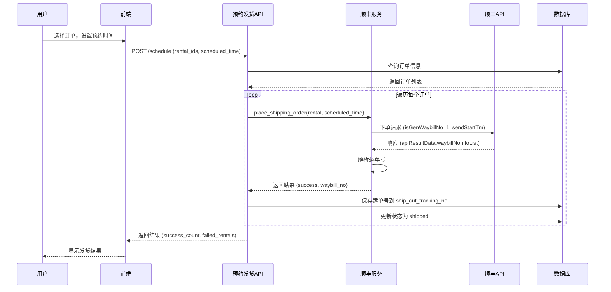

# 设计文档：简化批量发货流程

## 概述

本设计将批量发货流程从"手动扫描运单号"改为"自动获取运单号"，简化操作流程，提升发货效率。

## 架构变更

### 现有架构（旧流程）

```
用户 → 批量发货页面 → 打印发货单（带二维码）
                  ↓
            扫描发货单二维码
                  ↓
            显示订单详情
                  ↓
            扫描顺丰面单
                  ↓
     POST /api/shipping-batch/record-waybill
                  ↓
         保存运单号到数据库
                  ↓
            预约发货时间
                  ↓
     POST /api/shipping-batch/schedule
                  ↓
         调用顺丰API下单（传入已有运单号）
                  ↓
         调用闲鱼API发货通知
                  ↓
         更新订单状态为shipped
```

### 新架构（新流程）

```
用户 → 批量发货页面 → 选择订单
                  ↓
            设置预约时间
                  ↓
     POST /api/shipping-batch/schedule
                  ↓
  调用顺丰API下单（isGenWaybillNo=1，自动生成运单号）
                  ↓
     从API响应中提取运单号
                  ↓
     保存运单号到 rental.ship_out_tracking_no
                  ↓
     调用闲鱼API发货通知
                  ↓
     更新订单状态为shipped
```

## 关键技术决策

### 决策1: 使用顺丰API自动生成运单号

**背景**：顺丰API支持两种模式：
1. 预先提供运单号（`isGenWaybillNo=0`）
2. 自动生成运单号（`isGenWaybillNo=1`）

**决策**：使用模式2（自动生成）

**理由**：
- ✅ 简化流程，无需手动扫描
- ✅ 减少人为错误（扫错、遗漏）
- ✅ 无需额外硬件（扫码枪）
- ✅ 运单号与订单强关联，避免号码浪费

**权衡**：
- ❌ 无法提前获取运单号打印面单
- ✅ 但实际业务中不需要提前打印面单（可事后打印）

### 决策2: 删除扫码相关功能

**背景**：现有流程包含完整的扫码系统（二维码生成、扫码监听、弹窗、语音提示）

**决策**：完全删除扫码功能

**理由**：
- ✅ 简化代码维护
- ✅ 降低系统复杂度
- ✅ 减少依赖（不需要扫码枪）
- ✅ 符合"自动化优先"的设计原则

**风险缓解**：
- 如果顺丰API失败，整个下单流程失败，需要人工介入
- 通过详细的日志和错误提示，帮助快速定位问题

### 决策3: 在预约时立即下单

**背景**：之前的设计是"预约时间 → 定时任务下单"，已在前面的修改中改为"预约时立即下单"

**决策**：继续使用"预约时立即下单"

**理由**：
- ✅ 符合本次变更的前提（已实现）
- ✅ 简化系统，无需定时任务
- ✅ 立即反馈，用户体验更好
- ✅ 运单号立即可用

## 数据流设计

### 顺丰API交互流程



### 数据模型

**Rental 表**（相关字段）：

| 字段 | 类型 | 说明 | 变更 |
|------|------|------|------|
| `ship_out_tracking_no` | String | 运单号 | 修改：由手动扫描改为API自动获取 |
| `scheduled_ship_time` | DateTime | 预约发货时间 | 无变更 |
| `status` | String | 订单状态 | 无变更 |
| `ship_out_time` | DateTime | 实际发货时间 | 无变更 |

**不需要新增字段**，利用现有的 `ship_out_tracking_no` 字段即可。

## API设计

### 修改的API端点

#### POST /api/shipping-batch/schedule

**请求**（无变更）：
```json
{
  "rental_ids": [123, 456, 789],
  "scheduled_time": "2025-12-15T10:00:00Z"
}
```

**响应**（新增运单号信息）：
```json
{
  "success": true,
  "data": {
    "scheduled_count": 2,
    "failed_rentals": [
      {
        "id": 456,
        "reason": "顺丰下单失败: 收件地址不规范",
        "waybill_no": null
      }
    ],
    "results": [
      {
        "success": true,
        "rental_id": 123,
        "message": "预约发货成功",
        "waybill_no": "SF1234567890"
      },
      {
        "success": false,
        "rental_id": 456,
        "message": "顺丰下单失败: 收件地址不规范",
        "waybill_no": null
      },
      {
        "success": true,
        "rental_id": 789,
        "message": "预约发货成功",
        "waybill_no": "SF0987654321"
      }
    ]
  }
}
```

**变更点**：
- 响应中新增 `waybill_no` 字段，返回每个订单的运单号
- 便于前端显示和确认

### 删除的API端点

- ❌ `POST /api/shipping-batch/scan-rental` - 扫描发货单二维码
- ❌ `POST /api/shipping-batch/record-waybill` - 录入运单号

## 错误处理策略

### 错误分类

| 错误类型 | 示例 | 处理策略 |
|---------|------|---------|
| 网络错误 | 连接超时、DNS失败 | 记录ERROR日志，返回"网络异常，请重试" |
| 业务错误 | 地址不规范、月结账号无效 | 记录ERROR日志，返回顺丰API的具体错误信息 |
| 数据格式错误 | JSON解析失败、运单号缺失 | 记录ERROR日志，返回"顺丰API响应格式异常" |
| 部分成功 | 批量发货中部分订单失败 | 记录WARNING日志，返回详细的成功/失败列表 |

### 异常场景处理

#### 场景1: 顺丰API返回成功但无运单号

```python
if not waybill_no:
    logger.error(f"Rental {rental.id}: 顺丰API未返回运单号")
    return {
        'success': False,
        'rental_id': rental.id,
        'message': '顺丰API未返回运单号，请联系技术支持',
        'waybill_no': None
    }
```

#### 场景2: JSON解析失败

```python
try:
    api_result_data = json.loads(response.get('apiResultData'))
except json.JSONDecodeError as e:
    logger.error(f"Rental {rental.id}: 解析apiResultData失败: {e}")
    return {
        'success': False,
        'rental_id': rental.id,
        'message': '顺丰API响应格式异常',
        'waybill_no': None
    }
```

#### 场景3: 批量发货原子性

每个订单独立处理，一个失败不影响其他：

```python
for rental in rentals:
    try:
        result = process_single_rental(rental, scheduled_time)
        results.append(result)

        if result['success']:
            # 提交成功的订单
            db.session.commit()
            success_count += 1
        else:
            # 回滚失败的订单
            db.session.rollback()
            failed_count += 1
    except Exception as e:
        logger.error(f"处理 Rental {rental.id} 异常: {e}")
        db.session.rollback()
        results.append({
            'success': False,
            'rental_id': rental.id,
            'message': f'系统异常: {str(e)}'
        })
        failed_count += 1
```

## 日志设计

### 日志级别

- **INFO**: 正常流程（下单成功、运单号获取）
- **WARNING**: 部分成功、数据异常但可继续
- **ERROR**: 下单失败、解析失败

### 日志格式示例

```
[INFO] 2025-12-15 10:00:00 - 预约发货: Rental 123, 预约时间: 2025-12-15 14:00:00
[INFO] 2025-12-15 10:00:01 - 顺丰下单请求: Rental 123, isGenWaybillNo=1
[INFO] 2025-12-15 10:00:02 - 顺丰下单成功: Rental 123, 运单号: SF1234567890
[INFO] 2025-12-15 10:00:03 - 运单号已保存: Rental 123 -> SF1234567890
[ERROR] 2025-12-15 10:00:04 - 顺丰下单失败: Rental 456, 错误: 收件地址不规范
```

### 敏感信息脱敏

```python
def mask_sensitive(data):
    """脱敏敏感信息"""
    if 'checkword' in data:
        data['checkword'] = '***'
    if 'mobile' in data:
        data['mobile'] = data['mobile'][:3] + '****' + data['mobile'][-4:]
    return data
```

## 测试策略

### 单元测试重点

1. **响应解析测试**：
   - 正常响应
   - 空数组
   - 多个运单号
   - JSON格式错误

2. **参数构建测试**：
   - 验证 `isGenWaybillNo=1`
   - 验证 `waybillNoInfoList` 格式

### 集成测试重点

1. **顺丰API真实调用**：
   - 在测试环境下单，验证返回真实运单号
   - 验证运单号保存到数据库

2. **批量发货流程**：
   - 测试部分成功场景
   - 验证事务隔离

### 端到端测试重点

1. **完整用户流程**：
   - 从前端选择订单到发货成功
   - 验证UI显示的运单号与数据库一致

## 回滚方案

如果新流程出现严重问题，需要回滚：

1. **代码回滚**：
   - 恢复 `isGenWaybillNo=0`
   - 恢复 `/record-waybill` 和 `/scan-rental` 端点
   - 恢复前端扫码逻辑

2. **数据影响**：
   - 已经自动获取的运单号仍然有效
   - 新订单需要手动扫描运单号

3. **时间窗口**：
   - 可在1小时内完成回滚
   - 对用户影响：需要重新扫描运单号（仅影响回滚期间的新订单）

## 监控指标

| 指标 | 说明 | 目标 |
|------|------|------|
| 下单成功率 | 顺丰API调用成功次数 / 总调用次数 | > 95% |
| 平均响应时间 | 顺丰API平均响应时间 | < 2秒 |
| 运单号获取率 | 成功提取运单号次数 / 下单成功次数 | 100% |
| 批量发货失败率 | 批量发货中完全失败的批次 / 总批次 | < 5% |

## 兼容性说明

### 向后兼容

- ✅ 已有的手动录入运单号的订单不受影响
- ✅ 数据库字段无变更，不需要迁移
- ❌ 删除 `/record-waybill` 和 `/scan-rental` API（BREAKING）

### 前端兼容

- ❌ 前端扫码功能将被删除（BREAKING）
- ✅ 批量发货页面UI简化，用户体验提升

## 未来扩展

1. **运单号预分配**：
   - 支持提前获取运单号（不立即下单）
   - 用于需要提前打印面单的场景

2. **多快递支持**：
   - 扩展到其他快递（如中通、韵达）
   - 统一的运单号管理接口

3. **面单打印集成**：
   - 获取运单号后自动调用快麦打印面单
   - 与批量打印面单功能集成
