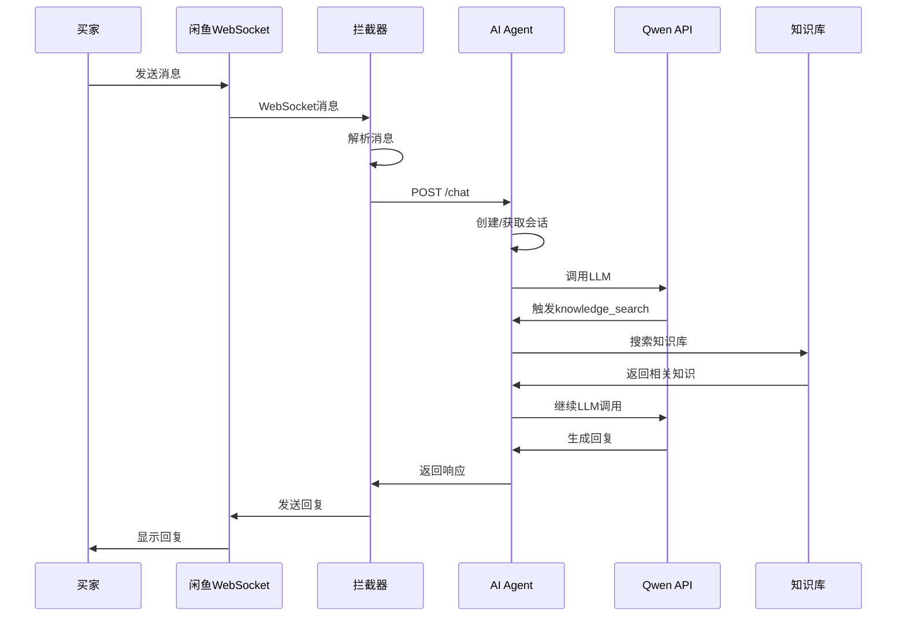

# AI客服 (ai_kefu) 项目详细文档

**项目名称**: AI客服 Agent 系统 (XianyuAutoAgent)  
**版本**: 1.0  
**最后更新**: 2025-12-24

---

## 📋 目录

1. [项目概述](#项目概述)
2. [核心功能](#核心功能)
3. [技术架构](#技术架构)
4. [系统组件](#系统组件)
5. [数据流程](#数据流程)
6. [项目结构](#项目结构)
7. [API接口](#api接口)
8. [配置说明](#配置说明)
9. [部署指南](#部署指南)
10. [开发指南](#开发指南)

---

## 项目概述

### 什么是 ai_kefu？

AI客服 (ai_kefu) 是一个**智能客服系统**，整合了两大核心功能：

1. **AI客服Agent服务** - 基于阿里云通义千问(Qwen)的智能对话系统
2. **闲鱼消息拦截器** - 自动拦截闲鱼消息并通过AI处理

### 项目背景

该项目旨在为闲鱼卖家提供自动化客服能力，通过AI Agent自动回复买家咨询，同时支持人工介入处理复杂问题。

### 主要应用场景

- **电商客服自动化**: 自动回答常见问题（退款、发货、售后等）
- **知识库检索**: 从预设知识库中查找相关答案
- **Human-in-the-Loop**: AI无法处理时请求人工协助
- **多轮对话**: 支持上下文关联的多轮对话

---

## 核心功能

### 1. AI对话引擎

**技术**: 基于阿里云通义千问 (Qwen) 大语言模型

**功能**:
- 生成自然语言回复
- 支持工具调用 (Function Calling)
- 流式响应和同步响应两种模式

**特点**:
- 中文优化，适合客服场景
- 32K tokens 上下文长度
- 支持最多50轮对话

### 2. 知识库检索

**技术**: Chroma 向量数据库 + Qwen Embeddings

**功能**:
- 语义搜索相关知识
- 支持增删改查知识条目
- 向量化存储和检索

**应用**:
- 退款政策、发货时间等标准化信息
- 商品介绍、使用说明
- 常见问题解答(FAQ)

### 3. Human-in-the-Loop (人工协助)

**功能**:
- AI遇到无法回答的问题时暂停
- 向人工客服请求帮助
- 人工回复后AI继续对话

**应用场景**:
- 需要查询外部系统（订单、库存等）
- 需要人工决策（退款审批等）
- 高风险操作确认

### 4. 闲鱼消息拦截器

**技术**: Playwright + Chrome DevTools Protocol (CDP)

**功能**:
- 拦截闲鱼WebSocket消息
- 解析闲鱼消息格式
- 通过HTTP调用AI Agent服务
- 将AI回复发送回闲鱼

**模式**:
- **自动模式**: AI自动回复
- **手动模式**: 发送关键词(如"。")切换，支持人工接管

### 5. 会话管理

**技术**: Redis (非持久化，TTL 30分钟)

**功能**:
- 存储对话历史
- 管理会话状态
- 支持闲鱼会话ID与Agent会话ID映射

---

## 技术架构

### 整体架构图

```
┌─────────────────────────────────────────────────────────────┐
│                    闲鱼 WebApp (浏览器)                      │
└────────────────────────┬────────────────────────────────────┘
                         │ WebSocket (CDP拦截)
                         ↓
┌─────────────────────────────────────────────────────────────┐
│              闲鱼消息拦截器 (Xianyu Interceptor)             │
│  ┌──────────────┐  ┌──────────────┐  ┌──────────────┐     │
│  │ Browser      │  │ CDP          │  │ Messaging    │     │
│  │ Controller   │→ │ Interceptor  │→ │ Core         │     │
│  └──────────────┘  └──────────────┘  └──────────────┘     │
│                           ↓                                  │
│                  ┌──────────────────┐                       │
│                  │ HTTP Client      │                       │
│                  │ (Message Handler)│                       │
│                  └────────┬─────────┘                       │
└───────────────────────────┼─────────────────────────────────┘
                            │ HTTP POST /chat
                            ↓
┌─────────────────────────────────────────────────────────────┐
│               AI Agent 服务 (Port 8000)                      │
│  ┌──────────────────────────────────────────────────────┐  │
│  │                 FastAPI API Layer                     │  │
│  │  • POST /chat (同步)  • POST /chat/stream (流式)     │  │
│  │  • GET /health        • Session 管理                 │  │
│  │  • Knowledge CRUD     • Human-in-the-Loop           │  │
│  └────────────────────┬─────────────────────────────────┘  │
│                       ↓                                      │
│  ┌──────────────────────────────────────────────────────┐  │
│  │               Agent 执行引擎                          │  │
│  │  • Turn 管理       • 工具调用                        │  │
│  │  • Loop 检测       • Event Hooks                     │  │
│  └────────┬──────────────────┬──────────────────────────┘  │
│           ↓                  ↓                              │
│  ┌─────────────┐    ┌──────────────┐                      │
│  │ Qwen LLM    │    │ 工具系统      │                      │
│  │ • qwen-plus │    │ • knowledge_  │                      │
│  │ • Embeddings│    │   search      │                      │
│  └─────────────┘    │ • complete_   │                      │
│                     │   task        │                      │
│                     │ • ask_human   │                      │
│                     └──────┬────────┘                      │
│                            ↓                                │
│  ┌──────────────────────────────────────────────────────┐  │
│  │                 存储层                                │  │
│  │  • Redis (会话)  • Chroma (知识库)                   │  │
│  └──────────────────────────────────────────────────────┘  │
└─────────────────────────────────────────────────────────────┘
```

### 技术栈

| 层次 | 技术 | 用途 |
|------|------|------|
| **编程语言** | Python 3.11+ | 主要开发语言 |
| **Web框架** | FastAPI | REST API服务 |
| **LLM** | 阿里云通义千问 (Qwen) | AI对话引擎 |
| **向量数据库** | ChromaDB | 知识库语义检索 |
| **缓存** | Redis | 会话状态存储 |
| **浏览器自动化** | Playwright | 闲鱼浏览器控制 |
| **HTTP客户端** | httpx | 异步HTTP通信 |
| **日志** | loguru | 结构化日志 |
| **容器化** | Docker + Docker Compose | 部署 |
| **测试** | pytest | 单元和集成测试 |
| **代码质量** | ruff + mypy | Linting和类型检查 |

---

## 系统组件

### 1. AI Agent 服务 (ai_kefu/)

#### 1.1 Agent 引擎 (ai_kefu/agent/)

**职责**: 核心对话引擎，实现Plan-Action-Check循环

**主要文件**:
- `executor.py`: Agent执行器，管理对话循环
- `turn.py`: 单轮对话处理逻辑
- `types.py`: Agent相关类型定义

**工作流程**:
```
1. Plan: 分析用户问题
2. Action: 调用Qwen API，可能触发工具调用
3. Check: 验证工具执行结果
4. Repeat: 继续下一轮或结束
```

#### 1.2 工具系统 (ai_kefu/tools/)

**可用工具**:

| 工具名称 | 功能 | 使用场景 |
|---------|------|---------|
| `knowledge_search` | 搜索知识库 | 查询退款政策、FAQ等 |
| `complete_task` | 标记对话完成 | 问题已解决，结束对话 |
| `ask_human_agent` | 请求人工协助 | 需要查询订单、人工决策等 |

**工具注册机制**:
- `tool_registry.py`: 工具注册中心
- 每个工具提供JSON Schema定义
- 转换为Qwen Function Calling格式

#### 1.3 API层 (ai_kefu/api/)

**路由模块**:

| 路由 | 文件 | 功能 |
|------|------|------|
| `/health` | `routes/system.py` | 健康检查 |
| `/chat` | `routes/chat.py` | 同步对话 |
| `/chat/stream` | `routes/chat.py` | 流式对话 |
| `/sessions/*` | `routes/session.py` | 会话管理 |
| `/knowledge/*` | `routes/knowledge.py` | 知识库CRUD |
| `/human-agent/*` | `routes/human_agent.py` | Human-in-the-Loop |

**依赖注入**:
- `dependencies.py`: FastAPI依赖工厂
- 提供SessionStore、KnowledgeStore、QwenClient等实例

#### 1.4 LLM客户端 (ai_kefu/llm/)

**模块**:
- `qwen_client.py`: Qwen API封装，支持同步/流式调用
- `embeddings.py`: 文本向量化 (使用Qwen text-embedding-v3)

**重试机制**: 使用tenacity实现指数退避重试

#### 1.5 存储层 (ai_kefu/storage/)

**SessionStore** (Redis):
- 键格式: `session:{session_id}`
- TTL: 30分钟
- 存储会话历史、Agent状态

**KnowledgeStore** (Chroma):
- Collection: `knowledge_base`
- 持久化存储
- 支持向量相似度搜索

#### 1.6 服务层 (ai_kefu/services/)

- `sentiment_service.py`: 情感分析
- `loop_detection.py`: 循环检测（防止工具重复调用）

#### 1.7 Hooks系统 (ai_kefu/hooks/)

**事件驱动架构**:
- `event_handler.py`: Hook基类
- `logging_hook.py`: 日志记录
- `sensitive_filter.py`: 敏感信息过滤

**可监听事件**:
- turn_start / turn_end
- tool_call
- conversation_complete

### 2. 闲鱼拦截器 (ai_kefu/xianyu_interceptor/)

#### 2.1 核心模块

| 模块 | 功能 |
|------|------|
| `config.py` | 配置管理 (pydantic-settings) |
| `models.py` | 数据模型 (Pydantic) |
| `browser_controller.py` | Playwright浏览器控制 |
| `cdp_interceptor.py` | CDP协议拦截WebSocket |
| `messaging_core.py` | 闲鱼消息编解码 |
| `http_client.py` | Agent服务HTTP客户端 |
| `session_mapper.py` | 会话ID映射 (内存/Redis) |
| `message_handler.py` | 消息处理主逻辑 |
| `manual_mode.py` | 手动模式管理 |
| `message_converter.py` | 格式转换 (闲鱼↔Agent) |

#### 2.2 消息流程

```
1. 浏览器加载闲鱼页面
2. CDP拦截WebSocket消息
3. 解析闲鱼消息格式
4. 检查是否手动模式
5. 获取/创建Agent session ID
6. 转换为Agent API格式
7. HTTP POST /chat
8. 接收Agent响应
9. 转换为闲鱼格式
10. 通过WebSocket发送回复
```

#### 2.3 会话映射

**为什么需要映射？**
- 闲鱼使用 `chat_id` 标识对话
- AI Agent使用 `session_id` (UUID) 标识会话
- 需要双向映射: `chat_id ↔ session_id`

**存储方式**:
- **Memory**: 内存字典，重启丢失
- **Redis**: 持久化，支持分布式

---

## 数据流程

### 1. 用户发起对话



### 2. Human-in-the-Loop流程

```
1. Agent调用ask_human_agent工具
2. 会话状态 → waiting_for_human
3. 创建HumanRequest对象
4. 人工客服查看待处理列表
5. 人工回复 (POST /sessions/{id}/human-response)
6. 会话状态 → active
7. Agent继续执行
```

---

## 项目结构

### 详细目录树

```
XianyuAutoAgent/
├── ai_kefu/                          # 主应用目录
│   ├── __init__.py
│   ├── main.py                       # 拦截器启动入口
│   │
│   ├── agent/                        # Agent引擎
│   │   ├── __init__.py
│   │   ├── executor.py              # Agent执行器
│   │   ├── turn.py                  # 单轮逻辑
│   │   └── types.py                 # 类型定义
│   │
│   ├── api/                          # FastAPI接口
│   │   ├── __init__.py
│   │   ├── main.py                  # FastAPI应用
│   │   ├── dependencies.py          # 依赖注入
│   │   ├── models.py                # API数据模型
│   │   └── routes/                  # 路由模块
│   │       ├── system.py            # 系统路由
│   │       ├── chat.py              # 聊天路由
│   │       ├── session.py           # 会话管理
│   │       ├── knowledge.py         # 知识库管理
│   │       └── human_agent.py       # 人工协助
│   │
│   ├── config/                       # 配置管理
│   │   ├── __init__.py
│   │   ├── settings.py              # 配置类
│   │   └── constants.py             # 常量定义
│   │
│   ├── hooks/                        # 事件钩子
│   │   ├── __init__.py
│   │   ├── event_handler.py         # Hook基类
│   │   ├── logging_hook.py          # 日志Hook
│   │   └── sensitive_filter.py      # 敏感信息过滤
│   │
│   ├── llm/                          # LLM客户端
│   │   ├── __init__.py
│   │   ├── qwen_client.py           # Qwen API封装
│   │   └── embeddings.py            # 向量化服务
│   │
│   ├── models/                       # 数据模型
│   │   ├── __init__.py
│   │   ├── session.py               # 会话模型
│   │   └── knowledge.py             # 知识库模型
│   │
│   ├── prompts/                      # 提示词
│   │   ├── __init__.py
│   │   ├── system_prompt.py         # 系统提示词
│   │   └── workflow_prompts.py      # 工作流提示
│   │
│   ├── scripts/                      # 工具脚本
│   │   ├── __init__.py
│   │   └── init_knowledge.py        # 初始化知识库
│   │
│   ├── services/                     # 业务服务
│   │   ├── __init__.py
│   │   ├── sentiment_service.py     # 情感分析
│   │   └── loop_detection.py        # 循环检测
│   │
│   ├── storage/                      # 存储层
│   │   ├── __init__.py
│   │   ├── session_store.py         # Redis会话存储
│   │   └── knowledge_store.py       # Chroma知识库
│   │
│   ├── tools/                        # Agent工具
│   │   ├── __init__.py
│   │   ├── tool_registry.py         # 工具注册
│   │   ├── knowledge_search.py      # 知识检索工具
│   │   ├── complete_task.py         # 完成任务工具
│   │   └── ask_human_agent.py       # 人工协助工具
│   │
│   ├── utils/                        # 工具函数
│   │   ├── __init__.py
│   │   ├── logging.py               # 日志配置
│   │   └── errors.py                # 异常定义
│   │
│   ├── xianyu_interceptor/          # 闲鱼拦截器
│   │   ├── __init__.py
│   │   ├── config.py                # 拦截器配置
│   │   ├── models.py                # 数据模型
│   │   ├── browser_controller.py   # 浏览器控制
│   │   ├── cdp_interceptor.py      # CDP拦截
│   │   ├── messaging_core.py       # 消息核心
│   │   ├── http_client.py          # HTTP客户端
│   │   ├── session_mapper.py       # 会话映射
│   │   ├── message_handler.py      # 消息处理
│   │   ├── manual_mode.py          # 手动模式
│   │   ├── message_converter.py    # 格式转换
│   │   ├── main_integration.py     # 集成入口
│   │   ├── logging_setup.py        # 日志设置
│   │   └── exceptions.py           # 异常定义
│   │
│   └── legacy/                       # 归档代码
│       ├── XianyuAgent.py           # 旧AI逻辑
│       ├── XianyuApis.py
│       └── context_manager.py
│
├── tests/                            # 测试
│   ├── unit/                        # 单元测试
│   │   ├── test_tools/
│   │   ├── test_services/
│   │   └── test_agent/
│   ├── integration/                 # 集成测试
│   │   ├── test_api/
│   │   └── test_workflow/
│   └── interceptor/                 # 拦截器测试
│       ├── test_http_client.py
│       ├── test_session_mapper.py
│       └── test_message_converter.py
│
├── specs/                            # 设计文档
│   ├── 001-ai-customer-service-agent/  # Feature 001
│   │   ├── spec.md
│   │   ├── plan.md
│   │   ├── research.md
│   │   ├── data-model.md
│   │   ├── quickstart.md
│   │   ├── tasks.md
│   │   └── contracts/openapi.yaml
│   └── 002-xianyu-agent-http-integration/  # Feature 002
│       ├── spec.md
│       ├── plan.md
│       ├── research.md
│       ├── data-model.md
│       ├── quickstart.md
│       └── tasks.md
│
├── docs/                             # 文档
│   ├── migration-002.md             # 迁移指南
│   └── PROJECT_OVERVIEW.md          # 本文档
│
├── .env.example                      # 环境变量模板
├── .gitignore                        # Git忽略文件
├── .dockerignore                     # Docker忽略文件
├── Dockerfile                        # Docker配置
├── docker-compose.yml                # Docker Compose
├── Makefile                          # 自动化命令
├── requirements.txt                  # Python依赖
└── README.md                         # 项目README
```

---

## API接口

### 核心API端点

#### 1. 聊天接口

**POST /chat** - 同步聊天

```bash
# 请求
curl -X POST http://localhost:8000/chat \
  -H "Content-Type: application/json" \
  -d '{
    "query": "如何申请退款？",
    "session_id": "optional-session-id",
    "user_id": "optional-user-id",
    "context": {}
  }'

# 响应
{
  "session_id": "550e8400-e29b-41d4-a716-446655440000",
  "response": "您可以在收到商品后7天内申请无理由退款...",
  "status": "active",
  "turn_counter": 3,
  "metadata": {}
}
```

**POST /chat/stream** - 流式聊天

```bash
curl -X POST http://localhost:8000/chat/stream \
  -H "Content-Type: application/json" \
  -d '{"query": "介绍一下退款流程"}'

# 响应 (SSE格式)
data: {"type": "chunk", "text": "退款"}
data: {"type": "chunk", "text": "流程"}
data: {"type": "chunk", "text": "如下"}
...
```

#### 2. 会话管理

**GET /sessions/{session_id}** - 获取会话

```bash
curl http://localhost:8000/sessions/550e8400-e29b-41d4-a716-446655440000

# 响应
{
  "session_id": "550e8400-...",
  "user_id": "user_123",
  "messages": [...],
  "status": "active",
  "turn_counter": 5,
  "created_at": "2025-12-24T10:00:00Z",
  "updated_at": "2025-12-24T10:05:00Z"
}
```

**DELETE /sessions/{session_id}** - 删除会话

#### 3. 知识库管理

**POST /knowledge** - 添加知识

```bash
curl -X POST http://localhost:8000/knowledge \
  -H "Content-Type: application/json" \
  -d '{
    "title": "退款政策",
    "content": "用户在收到商品后7天内可申请无理由退款...",
    "category": "售后服务",
    "tags": ["退款", "售后"]
  }'
```

**GET /knowledge** - 列出知识

**POST /knowledge/search** - 搜索知识

**PUT /knowledge/{id}** - 更新知识

**DELETE /knowledge/{id}** - 删除知识

#### 4. Human-in-the-Loop

**GET /human-agent/pending-requests** - 待处理请求列表

**GET /sessions/{session_id}/pending-request** - 查看具体请求

**POST /sessions/{session_id}/human-response** - 提交人工回复

#### 5. 系统接口

**GET /health** - 健康检查

```bash
curl http://localhost:8000/health

# 响应
{
  "status": "healthy",
  "checks": {
    "redis": "ok",
    "chroma": "ok",
    "qwen_api": "ok"
  }
}
```

### API文档访问

启动服务后访问:
- **Swagger UI**: http://localhost:8000/docs
- **ReDoc**: http://localhost:8000/redoc

---

## 配置说明

### 环境变量 (.env)

#### AI Agent配置

```bash
# Qwen API
QWEN_API_KEY=sk-xxx                    # 阿里云DashScope API Key
QWEN_MODEL=qwen-plus                   # 模型名称
QWEN_BASE_URL=https://dashscope.aliyuncs.com/api/v1

# Redis
REDIS_URL=redis://localhost:6379      # Redis连接URL
REDIS_SESSION_TTL=1800                 # 会话TTL(秒)

# Chroma
CHROMA_PERSIST_PATH=./chroma_data      # Chroma持久化路径

# Agent
MAX_TURNS=50                           # 最大对话轮次
TURN_TIMEOUT_SECONDS=120               # 单轮超时
LOOP_DETECTION_THRESHOLD=5             # 循环检测阈值

# 服务
API_HOST=0.0.0.0
API_PORT=8000

# 日志
LOG_LEVEL=INFO                         # DEBUG/INFO/WARNING/ERROR
LOG_FORMAT=json                        # json/text
```

#### 闲鱼拦截器配置

```bash
# 闲鱼账号
COOKIES_STR=your_cookies_here          # 闲鱼Cookie

# Agent服务
AGENT_SERVICE_URL=http://localhost:8000  # Agent服务地址
AGENT_TIMEOUT=10.0                     # HTTP超时
AGENT_MAX_RETRIES=3                    # 最大重试次数

# 浏览器
USE_BROWSER_MODE=true                  # 是否使用浏览器模式
BROWSER_HEADLESS=false                 # 无头模式
BROWSER_VIEWPORT_WIDTH=1280
BROWSER_VIEWPORT_HEIGHT=720

# 会话映射
SESSION_MAPPER_TYPE=memory             # memory 或 redis

# 手动模式
TOGGLE_KEYWORDS=。                     # 切换关键词
MANUAL_MODE_TIMEOUT=3600               # 超时(秒)
```

---

## 部署指南

### 方式1: 本地开发部署

#### 前置要求

```bash
# 安装Python 3.11+
python3.11 --version

# 安装Redis
brew install redis  # macOS
# 或
apt install redis-server  # Ubuntu

# 启动Redis
redis-server
```

#### 安装步骤

```bash
# 1. 克隆项目
git clone <repository-url>
cd XianyuAutoAgent

# 2. 创建虚拟环境
python3.11 -m venv venv
source venv/bin/activate

# 3. 安装依赖
pip install -r requirements.txt

# 4. 安装Playwright浏览器(如需拦截器)
playwright install chromium

# 5. 配置环境变量
cp .env.example .env
# 编辑 .env, 设置QWEN_API_KEY等

# 6. 初始化知识库
python ai_kefu/scripts/init_knowledge.py

# 7. 启动服务
uvicorn ai_kefu.api.main:app --reload --port 8000
```

### 方式2: Docker部署 (推荐生产环境)

```bash
# 1. 构建镜像
docker build -t ai-kefu-agent:latest .

# 或使用Makefile
make docker-build

# 2. 启动服务
docker-compose up -d

# 3. 查看日志
docker-compose logs -f

# 4. 停止服务
docker-compose down
```

#### docker-compose.yml示例

```yaml
version: '3.8'

services:
  redis:
    image: redis:7-alpine
    command: redis-server --save "" --appendonly no --maxmemory 2gb
    ports:
      - "6379:6379"
    healthcheck:
      test: ["CMD", "redis-cli", "ping"]
      interval: 10s
  
  ai-kefu:
    build: .
    ports:
      - "8000:8000"
    environment:
      - QWEN_API_KEY=${QWEN_API_KEY}
      - REDIS_URL=redis://redis:6379
    volumes:
      - ./chroma_data:/app/chroma_data
    depends_on:
      redis:
        condition: service_healthy
```

### 方式3: 生产部署 (systemd)

```bash
# 1. 创建systemd服务文件
sudo nano /etc/systemd/system/ai-kefu.service

# 内容:
[Unit]
Description=AI Customer Service Agent
After=network.target redis.service

[Service]
Type=notify
User=nobody
WorkingDirectory=/path/to/XianyuAutoAgent
Environment="PATH=/path/to/venv/bin"
ExecStart=/path/to/venv/bin/gunicorn ai_kefu.api.main:app \
  -w 4 \
  -k uvicorn.workers.UvicornWorker \
  --bind 0.0.0.0:8000
Restart=always

[Install]
WantedBy=multi-user.target

# 2. 启动服务
sudo systemctl daemon-reload
sudo systemctl enable ai-kefu
sudo systemctl start ai-kefu
sudo systemctl status ai-kefu
```

---

## 开发指南

### 开发环境设置

```bash
# 安装开发依赖
pip install -r requirements.txt

# 安装pre-commit hooks (可选)
pre-commit install
```

### 运行测试

```bash
# 运行所有测试
make test

# 或
pytest tests/ -v

# 运行特定测试
pytest tests/unit/test_tools/ -v

# 运行覆盖率测试
pytest tests/ --cov=ai_kefu --cov-report=html
```

### 代码质量检查

```bash
# Linting
make lint

# 或
ruff check ai_kefu/

# 类型检查
mypy ai_kefu/ --ignore-missing-imports
```

### 添加新工具

1. **创建工具文件** (`ai_kefu/tools/my_tool.py`):

```python
from typing import Dict, Any

def get_tool_definition() -> Dict[str, Any]:
    """返回工具的JSON Schema定义"""
    return {
        "type": "function",
        "function": {
            "name": "my_tool",
            "description": "工具描述",
            "parameters": {
                "type": "object",
                "properties": {
                    "param1": {
                        "type": "string",
                        "description": "参数描述"
                    }
                },
                "required": ["param1"]
            }
        }
    }

async def my_tool(param1: str, **kwargs) -> str:
    """工具实现"""
    # 执行逻辑
    return "结果"
```

2. **注册工具** (`ai_kefu/agent/executor.py`):

```python
from ai_kefu.tools.my_tool import my_tool, get_tool_definition

# 在ToolRegistry中注册
tool_registry.register_tool("my_tool", my_tool, get_tool_definition())
```

### 添加新API端点

1. **创建路由** (`ai_kefu/api/routes/my_route.py`):

```python
from fastapi import APIRouter, Depends

router = APIRouter()

@router.get("/my-endpoint")
async def my_endpoint():
    return {"message": "Hello"}
```

2. **注册路由** (`ai_kefu/api/main.py`):

```python
from ai_kefu.api.routes import my_route

app.include_router(my_route.router, prefix="/my", tags=["my"])
```

### 调试技巧

```bash
# 启用DEBUG日志
export LOG_LEVEL=DEBUG

# 查看详细日志
tail -f logs/*.log

# 使用ipdb调试
pip install ipdb
# 在代码中添加: import ipdb; ipdb.set_trace()
```

---

## 常见问题

### Q1: Agent服务无法启动

**症状**: `ModuleNotFoundError` 或 `ImportError`

**解决**:
```bash
# 确保在虚拟环境中
source venv/bin/activate

# 重新安装依赖
pip install -r requirements.txt
```

### Q2: Redis连接失败

**症状**: `Connection refused` 或 `Redis error`

**解决**:
```bash
# 检查Redis是否运行
redis-cli ping

# 启动Redis
redis-server

# 检查配置
echo $REDIS_URL
```

### Q3: Qwen API报错

**症状**: `403 Forbidden` 或 `Invalid API key`

**解决**:
```bash
# 检查API Key
echo $QWEN_API_KEY

# 验证配额
# 访问 https://dashscope.console.aliyun.com/
```

### Q4: 知识库为空

**症状**: Agent无法检索知识

**解决**:
```bash
# 初始化知识库
python ai_kefu/scripts/init_knowledge.py

# 检查Chroma数据
ls -la chroma_data/
```

### Q5: 浏览器无法启动

**症状**: `Browser launch failed`

**解决**:
```bash
# 安装Playwright浏览器
playwright install chromium

# 检查权限
ls -la ~/.cache/ms-playwright/

# 尝试无头模式
export BROWSER_HEADLESS=true
```

---

## 性能指标

### Agent服务

- **响应时间**: ~2s (P95)
- **并发能力**: 100+ (单进程) / 400+ (4 workers)
- **会话容量**: 10,000+ (Redis)
- **知识库容量**: 10,000+ 条目

### 闲鱼拦截器

- **消息处理延迟**: < 500ms (不含Agent处理)
- **并发对话**: 10-50个
- **内存占用**: ~500MB (含浏览器)

---

## 更多资源

### 文档链接

- [Feature 001: AI客服Agent](specs/001-ai-customer-service-agent/spec.md)
- [Feature 002: 闲鱼拦截器集成](specs/002-xianyu-agent-http-integration/spec.md)
- [API规范](specs/001-ai-customer-service-agent/contracts/openapi.yaml)
- [迁移指南](docs/migration-002.md)

### 外部资源

- [通义千问文档](https://help.aliyun.com/zh/dashscope/)
- [FastAPI文档](https://fastapi.tiangolo.com/)
- [Chroma文档](https://docs.trychroma.com/)
- [Playwright文档](https://playwright.dev/python/)

---

## 贡献指南

欢迎贡献！请遵循以下步骤:

1. Fork项目
2. 创建功能分支 (`git checkout -b feature/AmazingFeature`)
3. 提交更改 (`git commit -m 'Add some AmazingFeature'`)
4. 推送到分支 (`git push origin feature/AmazingFeature`)
5. 开启Pull Request

### 代码规范

- 遵循PEP 8
- 添加类型注解
- 编写文档字符串
- 添加单元测试

---

## 许可证

MIT License

---

## 联系方式

如有问题或建议，请联系开发团队或提交Issue。

---

**文档版本**: 1.0  
**最后更新**: 2025-12-24  
**维护者**: AI客服开发团队
